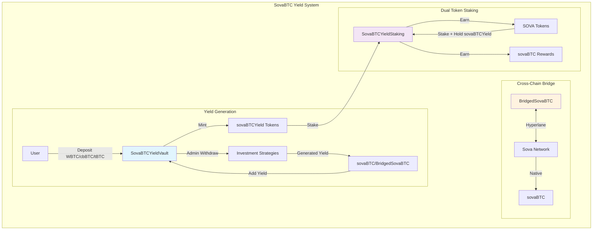
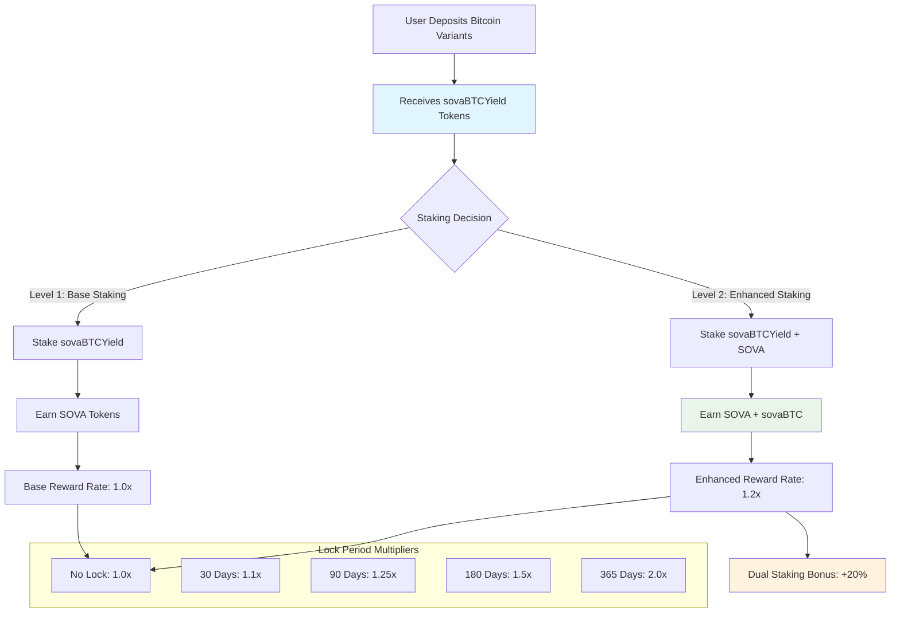
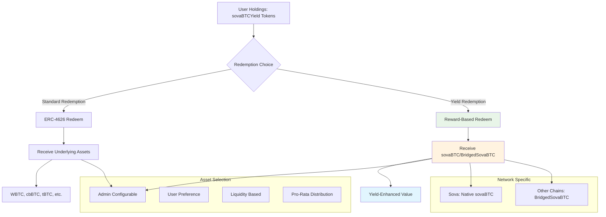

# SovaBTC Yield System

A comprehensive Bitcoin yield generation platform built for multi-chain deployment across Ethereum, Base, and Sova Network. The system enables users to deposit various Bitcoin variants (WBTC, cbBTC, tBTC, native sovaBTC) into ERC-4626 compliant yield vaults and earn Bitcoin-denominated yields through professionally managed investment strategies.

## 📋 Table of Contents

- [🚀 Overview](#-overview)
- [🏗️ System Architecture](#️-system-architecture)
- [📋 Core Contracts](#-core-contracts)
  - [1. SovaBTCYieldVault.sol](#1-sovabtcyieldvaultsol)
  - [2. BridgedSovaBTC.sol](#2-bridgedsovabtcsol)
  - [3. SovaBTCYieldStaking.sol](#3-sovabtcyieldstakingsol)
- [🔗 Hyperlane Integration](#-hyperlane-integration)
- [💰 Multi-Asset Collateral Support](#-multi-asset-collateral-support)
- [🥩 Rewards & Staking System](#-rewards--staking-system)
- [🔄 Redemption System](#-redemption-system)
- [🔗 sovaBTCYield Token Composability](#-sovabtcyield-token-composability)
- [🌐 Network Deployment](#-network-deployment)
- [🛠️ Development Setup](#️-development-setup)
- [🧪 Testing](#-testing)
- [🧪 Testnet Deployment](#-testnet-deployment)
- [🔒 Security & Risk Management](#-security--risk-management)
- [📊 Usage Examples](#-usage-examples)
- [🏛️ Architecture Decisions](#️-architecture-decisions)
- [📚 Documentation](#-documentation)
- [🤝 Contributing](#-contributing)
- [📄 License](#-license)
- [🔗 Links](#-links)

## 🚀 Overview

The SovaBTC Yield System consists of three core components that work together to provide a seamless Bitcoin yield experience:

- **🏦 SovaBTCYieldVault**: ERC-4626 compliant vault accepting multiple Bitcoin variants
- **🔗 BridgedSovaBTC**: Cross-chain sovaBTC token via Hyperlane protocol  
- **🥩 SovaBTCYieldStaking**: Dual token staking system with symbiotic rewards

### Key Features

- **Multi-Asset Support**: Accept WBTC, cbBTC, tBTC, and native sovaBTC
- **Professional Yield Generation**: Admin-managed investment strategies
- **Cross-Chain Distribution**: Native sovaBTC on Sova, bridged tokens elsewhere
- **Dual Token Staking**: Symbiotic staking rewards (sovaBTCYield → SOVA → sovaBTC)
- **Network-Aware Deployment**: Optimized for each target network
- **Enterprise Security**: Role-based access control, pausability, upgradeability

## 🏗️ System Architecture



## 📋 Core Contracts

### 1. SovaBTCYieldVault.sol
**ERC-4626 Compliant Yield Vault**

Multi-asset Bitcoin yield generation vault with professional investment strategy integration.

**Key Features:**
- ERC-4626 standard compliance with multi-asset support
- Decimal normalization for 6, 8, and 18 decimal assets
- Dynamic exchange rate tracking yield accumulation
- Admin-controlled asset withdrawal for investment strategies
- Network-aware reward token integration

**Critical Functions:**
```solidity
// Multi-asset deposit with automatic decimal normalization
function depositAsset(address asset, uint256 amount, address receiver) external returns (uint256 shares);

// Redeem vault shares for sovaBTC/BridgedSovaBTC rewards
function redeemForRewards(uint256 shares, address receiver) external returns (uint256 rewardAmount);

// Admin functions for investment strategy management
function adminWithdraw(address asset, uint256 amount, address destination) external onlyOwner;
function addYield(uint256 rewardAmount) external onlyOwner;
```

### 2. BridgedSovaBTC.sol
**Cross-Chain sovaBTC Token via Hyperlane**

Canonical sovaBTC representation on non-Sova networks using Hyperlane's burn-and-mint bridge pattern.

**Key Features:**
- ERC-20 with 8 decimals (matching native sovaBTC)
- Hyperlane integration for secure cross-chain messaging
- Role-based access control (BRIDGE_ROLE, VAULT_ROLE)
- Burn-and-mint bridge model for total supply consistency

**Critical Functions:**
```solidity
// Bridge tokens from current chain to Sova Network
function bridgeToSova(address recipient, uint256 amount) external;

// Handle incoming cross-chain messages (called by Hyperlane Mailbox)
function handle(uint32 origin, bytes32 sender, bytes calldata body) external;

// Mint tokens for authorized roles (vault/bridge)
function mint(address to, uint256 amount) external;
```

### 3. SovaBTCYieldStaking.sol
**Dual Token Staking System**

Two-tier symbiotic staking system requiring both sovaBTCYield and SOVA tokens for maximum rewards.

**Key Features:**
- Level 1: Stake sovaBTCYield → Earn SOVA tokens
- Level 2: Stake SOVA + maintain sovaBTCYield stake → Earn sovaBTC
- Lock periods with reward multipliers (1.0x to 2.0x)
- Dual staking bonus (+20% for holding both tokens)
- Emergency unstaking with penalties

**Critical Functions:**
```solidity
// Stake vault tokens to earn SOVA
function stakeVaultTokens(uint256 amount, uint256 lockPeriod) external;

// Stake SOVA to earn sovaBTC (requires vault tokens staked)
function stakeSova(uint256 amount, uint256 lockPeriod) external;

// Claim all accumulated rewards
function claimRewards() external;
```

## 🔗 Hyperlane Integration

The system uses **Hyperlane** as its cross-chain messaging protocol for secure sovaBTC bridging between networks.

### Architecture Design

The integration follows Hyperlane's **burn-and-mint bridge** pattern:

1. **Outbound Flow**: User calls `bridgeToSova()` → tokens burned → Hyperlane message dispatched → native sovaBTC minted on Sova
2. **Inbound Flow**: Sova network burns native sovaBTC → Hyperlane message → BridgedSovaBTC minted on destination chain

### Message Flow Specification

```solidity
// Outbound: Bridge to Sova Network
function bridgeToSova(address recipient, uint256 amount) external {
    _burn(msg.sender, amount);                                    // Burn tokens locally
    bytes memory message = abi.encode(recipient, amount);         // Encode message
    IHyperlaneMailbox(hyperlaneMailbox).dispatch(
        SOVA_DOMAIN,                                             // Destination domain
        addressToBytes32(SOVA_NETWORK_SOVABTC),                 // Target contract
        message                                                  // Message payload
    );
}

// Inbound: Handle messages from Hyperlane
function handle(uint32 origin, bytes32 sender, bytes calldata body) external {
    require(msg.sender == hyperlaneMailbox, "Invalid mailbox");  // Validate caller
    (address recipient, uint256 amount) = abi.decode(body, (address, uint256));
    _mint(recipient, amount);                                    // Mint tokens
}
```

### Security Model

- **Mailbox Validation**: Only configured Hyperlane Mailbox can call `handle()`
- **Message Authentication**: Hyperlane's cryptographic validation ensures message integrity
- **Domain Isolation**: Hardcoded domain IDs prevent cross-chain confusion
- **Role-Based Access**: BRIDGE_ROLE restricts minting to authorized relayers
- **Burn-and-Mint Consistency**: Maintains total supply consistency across all chains

## 💰 Multi-Asset Collateral Support

### Overview

The SovaBTCYieldVault is designed as a **multi-asset yield vault** that can accept various Bitcoin-backed tokens as collateral on each network. This design maximizes capital efficiency and provides users with flexibility in their Bitcoin holdings while generating unified yield.

### Supported Bitcoin Variants

Each vault deployment can support multiple Bitcoin-backed assets simultaneously:

| Network | Supported Assets | Status | Contract Addresses |
|---------|-----------------|--------|-------------------|
| **Ethereum** | WBTC, cbBTC, tBTC, BTCB | ✅ Ready | WBTC: `0x2260FAC5E5542a773Aa44fBCfeDf7C193bc2C599` |
| **Base** | cbBTC, tBTC, WBTC (bridged) | ✅ Ready | cbBTC: `0xcbB7C0000aB88B473b1f5aFd9ef808440eed33Bf` |
| **Sova Network** | Native sovaBTC, WBTC (bridged), cbBTC (bridged) | ✅ Ready | sovaBTC: `0x2100000000000000000000000000000000000020` |
| **Arbitrum** | WBTC, tBTC, cbBTC | 🔄 Planned | Coming Soon |
| **Polygon** | WBTC, tBTC | 🔄 Planned | Coming Soon |

### Asset Management Architecture

#### Decimal Normalization System

The vault automatically handles different decimal precisions across Bitcoin variants:

```solidity
// Automatic decimal normalization to 8 decimals (Bitcoin standard)
function _normalizeAmount(address asset, uint256 amount) internal view returns (uint256) {
    uint8 assetDecimals = IERC20Metadata(asset).decimals();
    uint8 targetDecimals = 8; // Bitcoin precision
    
    if (assetDecimals == targetDecimals) {
        return amount;
    } else if (assetDecimals > targetDecimals) {
        // Downscale (e.g., 18 decimals tBTC → 8 decimals)
        uint256 divisor = 10 ** (assetDecimals - targetDecimals);
        require(amount % divisor == 0, "Precision loss prevented");
        return amount / divisor;
    } else {
        // Upscale (e.g., 6 decimals → 8 decimals)
        return amount * (10 ** (targetDecimals - assetDecimals));
    }
}
```

#### Supported Decimal Configurations

| Asset Type | Decimals | Example Tokens | Normalization |
|------------|----------|----------------|---------------|
| **8 Decimals** | 8 | WBTC, cbBTC, sovaBTC | Direct (no conversion) |
| **18 Decimals** | 18 | tBTC | Downscale to 8 decimals |
| **6 Decimals** | 6 | USDC-backed BTC (future) | Upscale to 8 decimals |

### Adding New Collateral Types

#### 1. Admin Function for Asset Addition

```solidity
/**
 * @notice Add a new supported Bitcoin variant to the vault
 * @param asset The ERC20 token address of the Bitcoin variant
 * @param name Human-readable name for the asset (e.g., "Wrapped Bitcoin")
 */
function addSupportedAsset(address asset, string memory name) external onlyOwner {
    require(asset != address(0), "Zero address");
    require(!supportedAssets[asset], "Asset already supported");
    require(IERC20Metadata(asset).decimals() <= 18, "Too many decimals");
    
    supportedAssets[asset] = true;
    supportedAssetsList.push(asset);
    
    emit AssetAdded(asset, name);
}
```

#### 2. Step-by-Step Addition Process

**For Network Administrators:**

```bash
# 1. Verify the token contract and decimals
cast call <TOKEN_ADDRESS> "decimals()" --rpc-url <NETWORK_RPC>
cast call <TOKEN_ADDRESS> "symbol()" --rpc-url <NETWORK_RPC>
cast call <TOKEN_ADDRESS> "name()" --rpc-url <NETWORK_RPC>

# 2. Add the asset to the vault
cast send <VAULT_ADDRESS> "addSupportedAsset(address,string)" \
    <TOKEN_ADDRESS> "Token Name" \
    --private-key <ADMIN_KEY> --rpc-url <NETWORK_RPC>

# 3. Verify addition
cast call <VAULT_ADDRESS> "isAssetSupported(address)" <TOKEN_ADDRESS> --rpc-url <NETWORK_RPC>
```

#### 3. Asset Validation Requirements

Before adding a new Bitcoin variant, ensure:

- ✅ **ERC20 Compliance**: Standard ERC20 interface implementation
- ✅ **Bitcoin Backing**: 1:1 or verifiable backing with Bitcoin
- ✅ **Liquidity**: Sufficient on-chain liquidity for large redemptions
- ✅ **Security Audit**: Professional security audit of the token contract
- ✅ **Decimal Support**: 6, 8, or 18 decimals (automatically handled)
- ✅ **Rebase Protection**: No rebasing or deflationary mechanisms

### Multi-Asset Deposit Flow

#### User Experience

Users can deposit any supported Bitcoin variant in a single transaction:

```solidity
// Example: User deposits WBTC on Ethereum
function depositAsset(address asset, uint256 amount, address receiver) 
    external returns (uint256 shares) 
{
    require(supportedAssets[asset], "Asset not supported");
    
    // 1. Transfer asset from user
    IERC20(asset).safeTransferFrom(msg.sender, address(this), amount);
    
    // 2. Normalize to 8 decimals
    uint256 normalizedAmount = _normalizeAmount(asset, amount);
    
    // 3. Calculate shares based on current exchange rate
    uint256 shares = _calculateShares(normalizedAmount);
    
    // 4. Mint sovaBTCYield tokens to user
    _mint(receiver, shares);
    
    emit AssetDeposited(msg.sender, asset, amount, shares);
    return shares;
}
```

#### Unified Accounting

All assets are normalized to 8-decimal Bitcoin precision for unified accounting:

```solidity
// Total assets calculation across all supported types
function totalAssets() public view override returns (uint256) {
    uint256 total = 0;
    
    for (uint256 i = 0; i < supportedAssetsList.length; i++) {
        address asset = supportedAssetsList[i];
        uint256 balance = IERC20(asset).balanceOf(address(this));
        total += _normalizeAmount(asset, balance);
    }
    
    return total + assetsUnderManagement;
}
```

### Asset Management Features

#### 1. Asset Enumeration

```solidity
// Get all supported assets
function getSupportedAssets() external view returns (address[] memory) {
    return supportedAssetsList;
}

// Get asset information
function getAssetInfo(address asset) external view returns (
    bool isSupported,
    string memory name,
    uint8 decimals,
    uint256 balance
) {
    isSupported = supportedAssets[asset];
    if (isSupported) {
        IERC20Metadata token = IERC20Metadata(asset);
        name = token.name();
        decimals = token.decimals();
        balance = token.balanceOf(address(this));
    }
}
```

#### 2. Asset-Specific Analytics

Track deposits and performance by asset type:

```solidity
// Asset-specific tracking
mapping(address => uint256) public assetTotalDeposited;
mapping(address => uint256) public assetCurrentBalance;

// Update on each deposit
function _trackAssetDeposit(address asset, uint256 amount) internal {
    assetTotalDeposited[asset] += amount;
    assetCurrentBalance[asset] = IERC20(asset).balanceOf(address(this));
}
```

#### 3. Investment Strategy Allocation

Admin can withdraw any supported asset for investment strategies:

```solidity
/**
 * @notice Withdraw specific asset for investment strategies
 * @param asset The Bitcoin variant to withdraw
 * @param amount Amount in asset's native decimals
 * @param destination Investment strategy contract address
 */
function adminWithdraw(address asset, uint256 amount, address destination) 
    external onlyOwner 
{
    require(supportedAssets[asset], "Asset not supported");
    require(IERC20(asset).balanceOf(address(this)) >= amount, "Insufficient balance");
    
    // Update tracking
    uint256 normalizedAmount = _normalizeAmount(asset, amount);
    assetsUnderManagement += normalizedAmount;
    
    // Transfer to investment strategy
    IERC20(asset).safeTransfer(destination, amount);
    
    emit AdminWithdrawal(asset, amount, destination);
}
```

### Network-Specific Asset Strategies

#### Ethereum Mainnet Strategy
- **Primary**: WBTC (highest liquidity)
- **Secondary**: cbBTC (institutional grade)
- **Alternative**: tBTC (decentralized)
- **Future**: Additional institutional Bitcoin products

#### Base Network Strategy
- **Primary**: cbBTC (native Coinbase integration)
- **Secondary**: tBTC (cross-chain from Ethereum)
- **Alternative**: Bridged WBTC
- **Future**: Base-native Bitcoin products

#### Sova Network Strategy
- **Primary**: Native sovaBTC (direct Bitcoin backing)
- **Secondary**: Bridged major Bitcoin variants
- **Integration**: Direct Bitcoin precompile access
- **Future**: Bitcoin L2 integrations

### Security Considerations for Multi-Asset Support

#### Asset Risk Assessment

Each asset undergoes evaluation:

1. **Smart Contract Risk**: Audit quality and upgrade mechanisms
2. **Custody Risk**: Bitcoin backing and custodial security
3. **Liquidity Risk**: On-chain and off-chain liquidity depth
4. **Regulatory Risk**: Compliance and regulatory standing
5. **Technical Risk**: Integration complexity and edge cases

#### Risk Mitigation Strategies

```solidity
// Asset-specific limits and controls
mapping(address => uint256) public assetDepositCaps;
mapping(address => bool) public assetPaused;

function setAssetDepositCap(address asset, uint256 cap) external onlyOwner {
    require(supportedAssets[asset], "Asset not supported");
    assetDepositCaps[asset] = cap;
}

function pauseAsset(address asset) external onlyOwner {
    require(supportedAssets[asset], "Asset not supported");
    assetPaused[asset] = true;
}
```

### Future Expansion Opportunities

#### Layer 2 Bitcoin Solutions
- **Lightning Network**: Integration with Lightning-backed tokens
- **Bitcoin L2s**: Support for emerging Bitcoin Layer 2 solutions
- **Liquid Network**: L-BTC integration for institutional users

#### Institutional Products
- **ETFs**: Bitcoin ETF token integrations
- **Bank Products**: Traditional finance Bitcoin products
- **Custody Solutions**: Enterprise-grade Bitcoin custodial tokens

#### Cross-Chain Expansion
- **Additional Networks**: Polygon, Avalanche, Fantom support
- **Hyperlane Growth**: New chains as Hyperlane expands
- **Interoperability**: Integration with other bridge protocols

This multi-asset architecture provides maximum flexibility while maintaining security and unified yield generation across all supported Bitcoin variants.

## 🥩 Rewards & Staking System

### Overview

The SovaBTC Yield System features a sophisticated **dual token staking mechanism** that creates symbiotic relationships between vault participation and governance token staking. This design incentivizes long-term commitment while providing multiple layers of rewards.

### Dual Token Staking Architecture



### Staking Mechanics Deep Dive

#### 1. Level 1 Staking: sovaBTCYield → SOVA

**Requirements**: Only sovaBTCYield tokens staked

```solidity
/**
 * @notice Stake vault tokens to earn SOVA rewards
 * @param amount Amount of sovaBTCYield tokens to stake
 * @param lockPeriod Lock duration (0, 30, 90, 180, or 365 days)
 */
function stakeVaultTokens(uint256 amount, uint256 lockPeriod) external {
    require(amount > 0, "Zero amount");
    require(isValidLockPeriod(lockPeriod), "Invalid lock period");
    
    // Transfer vault tokens to staking contract
    vaultToken.safeTransferFrom(msg.sender, address(this), amount);
    
    // Update user stake
    UserStake storage userStake = userStakes[msg.sender];
    userStake.vaultTokenAmount += amount;
    userStake.lockEndTime = block.timestamp + lockPeriod;
    userStake.lastRewardUpdate = block.timestamp;
    
    emit VaultTokensStaked(msg.sender, amount, lockPeriod);
}
```

**Reward Calculation**:
```solidity
// SOVA rewards = staked_amount × rate × time × lock_multiplier
sovaRewards = vaultTokenAmount × vaultToSovaRate × timeStaked × lockMultiplier / 10000;
```

#### 2. Level 2 Staking: SOVA + sovaBTCYield → Enhanced Rewards

**Requirements**: Must have sovaBTCYield tokens staked + additional SOVA staking

```solidity
/**
 * @notice Stake SOVA tokens for enhanced rewards (requires vault tokens staked)
 * @param amount Amount of SOVA tokens to stake
 * @param lockPeriod Lock duration (must match or exceed vault token lock)
 */
function stakeSova(uint256 amount, uint256 lockPeriod) external {
    UserStake storage userStake = userStakes[msg.sender];
    require(userStake.vaultTokenAmount > 0, "Must stake vault tokens first");
    require(amount > 0, "Zero amount");
    
    // Transfer SOVA tokens to staking contract
    sovaToken.safeTransferFrom(msg.sender, address(this), amount);
    
    // Update user stake
    userStake.sovaAmount += amount;
    userStake.lockEndTime = block.timestamp + lockPeriod;
    
    emit SovaStaked(msg.sender, amount, lockPeriod);
}
```

**Enhanced Reward Calculation**:
```solidity
// Dual staking provides both SOVA and sovaBTC rewards with bonus
sovaRewards = vaultTokenAmount × vaultToSovaRate × timeStaked × lockMultiplier × dualBonus / 10000;
sovaBTCRewards = sovaAmount × sovaToSovaBTCRate × timeStaked × lockMultiplier / 10000;
```

### Lock Period & Reward Multipliers

#### Lock Period Configuration

| Lock Duration | Multiplier | APY Boost | Use Case |
|---------------|------------|-----------|----------|
| **No Lock (0 days)** | 1.0x | Baseline | Flexible liquidity |
| **30 Days** | 1.1x | +10% | Short-term commitment |
| **90 Days** | 1.25x | +25% | Medium-term planning |
| **180 Days** | 1.5x | +50% | Long-term strategy |
| **365 Days** | 2.0x | +100% | Maximum commitment |

#### Admin Configuration

```solidity
/**
 * @notice Configure lock period multipliers
 * @param lockPeriods Array of lock durations in seconds
 * @param multipliers Array of corresponding multipliers (basis points)
 */
function setLockMultipliers(uint256[] memory lockPeriods, uint256[] memory multipliers) 
    external onlyOwner 
{
    require(lockPeriods.length == multipliers.length, "Array length mismatch");
    
    for (uint256 i = 0; i < lockPeriods.length; i++) {
        require(multipliers[i] >= 1000, "Multiplier too low"); // Minimum 1.0x
        require(multipliers[i] <= 5000, "Multiplier too high"); // Maximum 5.0x
        lockMultipliers[lockPeriods[i]] = multipliers[i];
    }
}
```

### Reward Rate Configuration

#### Administrative Controls

```solidity
/**
 * @notice Set reward rates for the staking system
 * @param _vaultToSovaRate SOVA earned per vault token per second (wei)
 * @param _sovaToSovaBTCRate sovaBTC earned per SOVA per second (wei)  
 * @param _dualStakeMultiplier Bonus multiplier for dual staking (basis points)
 */
function setRewardRates(
    uint256 _vaultToSovaRate,
    uint256 _sovaToSovaBTCRate, 
    uint256 _dualStakeMultiplier
) external onlyOwner {
    require(_dualStakeMultiplier >= 10000, "Bonus cannot be negative");
    require(_dualStakeMultiplier <= 50000, "Bonus too high (max 500%)");
    
    vaultToSovaRate = _vaultToSovaRate;
    sovaToSovaBTCRate = _sovaToSovaBTCRate;
    dualStakeMultiplier = _dualStakeMultiplier;
    
    emit RewardRatesUpdated(_vaultToSovaRate, _sovaToSovaBTCRate, _dualStakeMultiplier);
}
```

#### Example Rate Calculations

**Typical Configuration**:
```solidity
// Example reward rates (per second, per token)
vaultToSovaRate = 1e15;        // ~3.15% APY base rate
sovaToSovaBTCRate = 5e14;      // ~1.58% APY for sovaBTC rewards
dualStakeMultiplier = 12000;   // 20% bonus for dual staking
```

**APY Calculation Example**:
```javascript
// For 1 sovaBTCYield token staked for 1 year with 365-day lock
const baseReward = 1 * 1e15 * 31536000; // 1 token × rate × seconds per year
const lockMultiplier = 2.0; // 365-day lock = 2.0x
const dualBonus = 1.2; // 20% bonus for dual staking
const finalAPY = baseReward * lockMultiplier * dualBonus / 1e18 * 100;
// Result: ~7.56% APY for maximum commitment dual staking
```

### Reward Pool Management

#### Funding the Reward System

```solidity
/**
 * @notice Add reward tokens to the staking contract
 * @param sovaAmount Amount of SOVA tokens to add for rewards
 * @param sovaBTCAmount Amount of sovaBTC tokens to add for rewards
 */
function addRewards(uint256 sovaAmount, uint256 sovaBTCAmount) external onlyOwner {
    if (sovaAmount > 0) {
        sovaToken.safeTransferFrom(msg.sender, address(this), sovaAmount);
        totalSovaRewards += sovaAmount;
    }
    
    if (sovaBTCAmount > 0) {
        rewardToken.safeTransferFrom(msg.sender, address(this), sovaBTCAmount);
        totalSovaBTCRewards += sovaBTCAmount;
    }
    
    emit RewardsAdded(sovaAmount, sovaBTCAmount);
}
```

#### Reward Pool Analytics

```solidity
/**
 * @notice Get current reward pool status
 */
function getRewardPoolStatus() external view returns (
    uint256 sovaReserves,
    uint256 sovaBTCReserves,
    uint256 totalSovaDistributed,
    uint256 totalSovaBTCDistributed,
    uint256 estimatedDaysRemaining
) {
    sovaReserves = sovaToken.balanceOf(address(this)) - totalSovaStaked;
    sovaBTCReserves = rewardToken.balanceOf(address(this));
    totalSovaDistributed = totalSovaRewards - sovaReserves;
    totalSovaBTCDistributed = totalSovaBTCRewards - sovaBTCReserves;
    
    // Estimate days remaining at current reward rate
    uint256 currentDailyDistribution = getCurrentDailyRewardRate();
    if (currentDailyDistribution > 0) {
        estimatedDaysRemaining = sovaReserves / currentDailyDistribution;
    }
}
```

### Advanced Staking Features

#### 1. Compound Staking

```solidity
/**
 * @notice Compound SOVA rewards back into SOVA stake
 */
function compoundSovaRewards() external {
    (uint256 sovaRewards,) = getPendingRewards(msg.sender);
    require(sovaRewards > 0, "No rewards to compound");
    
    // Claim SOVA rewards
    _claimSovaRewards(msg.sender);
    
    // Automatically stake claimed SOVA
    UserStake storage userStake = userStakes[msg.sender];
    userStake.sovaAmount += sovaRewards;
    
    emit RewardsCompounded(msg.sender, sovaRewards);
}
```

#### 2. Emergency Unstaking

```solidity
/**
 * @notice Emergency unstake with penalties (available even when paused)
 */
function emergencyUnstake() external {
    UserStake storage userStake = userStakes[msg.sender];
    require(userStake.vaultTokenAmount > 0 || userStake.sovaAmount > 0, "No stake");
    
    // Calculate penalties
    uint256 vaultPenalty = userStake.vaultTokenAmount * VAULT_EMERGENCY_PENALTY / 10000; // 10%
    uint256 sovaPenalty = userStake.sovaAmount * SOVA_EMERGENCY_PENALTY / 10000; // 20%
    
    // Return tokens minus penalties
    if (userStake.vaultTokenAmount > 0) {
        uint256 returnAmount = userStake.vaultTokenAmount - vaultPenalty;
        vaultToken.safeTransfer(msg.sender, returnAmount);
    }
    
    if (userStake.sovaAmount > 0) {
        uint256 returnAmount = userStake.sovaAmount - sovaPenalty;
        sovaToken.safeTransfer(msg.sender, returnAmount);
    }
    
    // Forfeit all pending rewards
    delete userStakes[msg.sender];
    
    emit EmergencyUnstake(msg.sender, vaultPenalty, sovaPenalty);
}
```

#### 3. Staking Analytics & Insights

```solidity
/**
 * @notice Get detailed staking information for a user
 */
function getStakingDetails(address user) external view returns (
    uint256 vaultTokensStaked,
    uint256 sovaTokensStaked,
    uint256 lockEndTime,
    uint256 currentMultiplier,
    uint256 pendingSovaRewards,
    uint256 pendingSovaBTCRewards,
    uint256 estimatedDailyRewards,
    bool isDualStaking
) {
    UserStake memory userStake = userStakes[user];
    
    vaultTokensStaked = userStake.vaultTokenAmount;
    sovaTokensStaked = userStake.sovaAmount;
    lockEndTime = userStake.lockEndTime;
    currentMultiplier = _getLockMultiplier(userStake.lockEndTime - block.timestamp);
    
    (pendingSovaRewards, pendingSovaBTCRewards) = getPendingRewards(user);
    
    isDualStaking = vaultTokensStaked > 0 && sovaTokensStaked > 0;
    
    // Calculate estimated daily rewards
    estimatedDailyRewards = _calculateDailyRewards(user);
}
```

### Network-Specific Reward Configurations

#### Ethereum Mainnet
- **SOVA Rate**: 1e15 per second (~3.15% base APY)
- **sovaBTC Rate**: 5e14 per second (~1.58% base APY)  
- **Dual Bonus**: 20% (12000 basis points)
- **Max Lock Multiplier**: 2.0x (365 days)

#### Base Network
- **SOVA Rate**: 1.2e15 per second (~3.78% base APY)
- **sovaBTC Rate**: 6e14 per second (~1.89% base APY)
- **Dual Bonus**: 25% (12500 basis points)
- **Max Lock Multiplier**: 2.0x (365 days)

#### Sova Network
- **SOVA Rate**: 8e14 per second (~2.52% base APY)
- **sovaBTC Rate**: 1e15 per second (~3.15% base APY)
- **Dual Bonus**: 30% (13000 basis points)
- **Max Lock Multiplier**: 2.5x (365 days)

### Performance Optimization Features

#### Gas-Efficient Reward Claims

```solidity
/**
 * @notice Batch claim rewards for multiple users (admin function)
 */
function batchClaimRewards(address[] calldata users) external onlyOwner {
    for (uint256 i = 0; i < users.length; i++) {
        if (userStakes[users[i]].vaultTokenAmount > 0) {
            _claimRewards(users[i]);
        }
    }
}

/**
 * @notice Auto-compound rewards during other operations
 */
modifier autoCompound() {
    if (shouldAutoCompound(msg.sender)) {
        _compoundRewards(msg.sender);
    }
    _;
}
```

## 🔄 Redemption System

### Overview

The SovaBTC Yield System provides **flexible redemption mechanisms** that allow users to exit their positions in multiple ways, each optimized for different use cases. The system supports both **standard ERC-4626 redemptions** for underlying assets and **yield-optimized redemptions** for sovaBTC rewards.

### Redemption Architecture



### Redemption Types

#### 1. Standard ERC-4626 Redemption

**Purpose**: Exchange vault shares for underlying Bitcoin assets

```solidity
/**
 * @notice Standard ERC-4626 redemption for underlying assets
 * @param shares Amount of vault shares to redeem
 * @param receiver Address to receive the assets
 * @param owner Address of the share owner
 * @return assets Amount of underlying assets received
 */
function redeem(uint256 shares, address receiver, address owner) 
    external 
    returns (uint256 assets) 
{
    // Validate redemption
    require(shares > 0, "Zero shares");
    require(receiver != address(0), "Zero address");
    
    // Check allowance if not owner
    if (msg.sender != owner) {
        uint256 allowed = allowance(owner, msg.sender);
        require(allowed >= shares, "Insufficient allowance");
        _approve(owner, msg.sender, allowed - shares);
    }
    
    // Calculate asset amount
    assets = convertToAssets(shares);
    require(assets > 0, "Zero assets");
    
    // Burn shares
    _burn(owner, shares);
    
    // Distribute underlying assets
    _distributeUnderlyingAssets(receiver, assets);
    
    emit Withdraw(msg.sender, receiver, owner, assets, shares);
}
```

**Asset Distribution Logic**:
```solidity
function _distributeUnderlyingAssets(address receiver, uint256 totalAssets) internal {
    // Get available asset balances
    uint256 totalAvailable = 0;
    uint256[] memory balances = new uint256[](supportedAssetsList.length);
    
    for (uint256 i = 0; i < supportedAssetsList.length; i++) {
        address asset = supportedAssetsList[i];
        balances[i] = IERC20(asset).balanceOf(address(this));
        totalAvailable += _normalizeAmount(asset, balances[i]);
    }
    
    // Distribute pro-rata based on availability
    for (uint256 i = 0; i < supportedAssetsList.length; i++) {
        if (balances[i] > 0) {
            address asset = supportedAssetsList[i];
            uint256 normalizedBalance = _normalizeAmount(asset, balances[i]);
            uint256 shareOfTotal = normalizedBalance * totalAssets / totalAvailable;
            
            // Convert back to asset decimals and transfer
            uint256 assetAmount = _denormalizeAmount(asset, shareOfTotal);
            if (assetAmount > 0) {
                IERC20(asset).safeTransfer(receiver, assetAmount);
            }
        }
    }
}
```

#### 2. Yield-Optimized Redemption

**Purpose**: Exchange vault shares for sovaBTC rewards at enhanced exchange rate

```solidity
/**
 * @notice Redeem vault shares for sovaBTC/BridgedSovaBTC rewards
 * @param shares Amount of vault shares to redeem
 * @param receiver Address to receive reward tokens
 * @return rewardAmount Amount of reward tokens received
 */
function redeemForRewards(uint256 shares, address receiver) 
    external 
    returns (uint256 rewardAmount) 
{
    require(shares > 0, "Zero shares");
    require(receiver != address(0), "Zero address");
    require(balanceOf(msg.sender) >= shares, "Insufficient balance");
    
    // Calculate reward amount using exchange rate
    rewardAmount = shares * exchangeRate / EXCHANGE_RATE_PRECISION;
    require(rewardAmount > 0, "Zero rewards");
    
    // Check reward token availability
    require(rewardToken.balanceOf(address(this)) >= rewardAmount, "Insufficient rewards");
    
    // Burn vault shares
    _burn(msg.sender, shares);
    
    // Transfer reward tokens
    rewardToken.safeTransfer(receiver, rewardAmount);
    
    emit RewardTokensRedeemed(msg.sender, shares, rewardAmount);
}
```

**Exchange Rate Mechanism**:
```solidity
// Exchange rate increases as yield is added to the vault
// Initial rate: 1:1 (1e18 precision)
// After yield: rate = (totalAssets + accumulatedYield) / totalShares
function updateExchangeRate(uint256 yieldAdded) internal {
    if (totalSupply() > 0) {
        uint256 newTotalValue = totalAssets() + yieldAdded;
        exchangeRate = newTotalValue * EXCHANGE_RATE_PRECISION / totalSupply();
    }
}
```

### Redemption Configuration

#### Admin Controls

```solidity
/**
 * @notice Configure redemption parameters
 * @param _minRedemptionAmount Minimum amount required for redemption
 * @param _redemptionFee Fee percentage for redemptions (basis points)
 * @param _preferredAsset Asset to prefer for single-asset redemptions
 */
function setRedemptionConfig(
    uint256 _minRedemptionAmount,
    uint256 _redemptionFee,
    address _preferredAsset
) external onlyOwner {
    require(_redemptionFee <= MAX_REDEMPTION_FEE, "Fee too high"); // Max 2%
    require(_preferredAsset == address(0) || supportedAssets[_preferredAsset], "Invalid asset");
    
    minRedemptionAmount = _minRedemptionAmount;
    redemptionFee = _redemptionFee;
    preferredRedemptionAsset = _preferredAsset;
    
    emit RedemptionConfigUpdated(_minRedemptionAmount, _redemptionFee, _preferredAsset);
}
```

#### Redemption Modes

```solidity
enum RedemptionMode {
    ProRata,        // Distribute across all available assets proportionally
    PreferredAsset, // Try preferred asset first, fallback to pro-rata
    SingleAsset,    // Redeem in single specified asset (if available)
    YieldOptimized  // Redeem for sovaBTC rewards using exchange rate
}

/**
 * @notice Set default redemption mode for the vault
 * @param mode The redemption mode to use as default
 */
function setDefaultRedemptionMode(RedemptionMode mode) external onlyOwner {
    defaultRedemptionMode = mode;
    emit RedemptionModeUpdated(mode);
}
```

#### Advanced Redemption Options

```solidity
/**
 * @notice Redeem with specific asset preference
 * @param shares Amount of shares to redeem
 * @param receiver Address to receive assets
 * @param preferredAsset Asset to prefer for redemption
 * @param mode Redemption mode to use
 */
function redeemWithPreference(
    uint256 shares,
    address receiver,
    address preferredAsset,
    RedemptionMode mode
) external returns (uint256[] memory amounts) {
    require(shares >= minRedemptionAmount, "Below minimum");
    require(supportedAssets[preferredAsset] || preferredAsset == address(0), "Invalid asset");
    
    // Calculate total asset value
    uint256 totalAssetValue = convertToAssets(shares);
    
    // Apply redemption fee if configured
    if (redemptionFee > 0) {
        uint256 fee = totalAssetValue * redemptionFee / 10000;
        totalAssetValue -= fee;
        // Fee stays in vault to benefit remaining holders
    }
    
    // Execute redemption based on mode
    amounts = _executeRedemption(receiver, totalAssetValue, preferredAsset, mode);
    
    // Burn shares after successful redemption
    _burn(msg.sender, shares);
    
    emit RedemptionExecuted(msg.sender, receiver, shares, amounts, mode);
}
```

### Liquidity Management

#### Redemption Queue System

For large redemptions that may exceed available liquidity:

```solidity
struct RedemptionRequest {
    address user;
    uint256 shares;
    uint256 requestTime;
    address preferredAsset;
    RedemptionMode mode;
    bool fulfilled;
    uint256 queuePosition;
}

mapping(uint256 => RedemptionRequest) public redemptionQueue;
uint256 public nextQueueId;
uint256 public queueProcessingDelay = 24 hours;

/**
 * @notice Request redemption when immediate liquidity is insufficient
 * @param shares Amount of shares to redeem
 * @param preferredAsset Preferred asset for redemption
 * @param mode Redemption mode
 */
function requestRedemption(
    uint256 shares,
    address preferredAsset,
    RedemptionMode mode
) external returns (uint256 requestId) {
    require(shares >= minRedemptionAmount, "Below minimum");
    require(balanceOf(msg.sender) >= shares, "Insufficient balance");
    
    // Lock shares by transferring to contract
    _transfer(msg.sender, address(this), shares);
    
    requestId = ++nextQueueId;
    redemptionQueue[requestId] = RedemptionRequest({
        user: msg.sender,
        shares: shares,
        requestTime: block.timestamp,
        preferredAsset: preferredAsset,
        mode: mode,
        fulfilled: false,
        queuePosition: requestId
    });
    
    emit RedemptionRequested(requestId, msg.sender, shares, preferredAsset);
}

/**
 * @notice Process queued redemption requests (admin or automated)
 * @param requestId The redemption request to process
 */
function processQueuedRedemption(uint256 requestId) external {
    RedemptionRequest storage request = redemptionQueue[requestId];
    require(!request.fulfilled, "Already fulfilled");
    require(block.timestamp >= request.requestTime + queueProcessingDelay, "Too early");
    
    // Check if liquidity is now available
    uint256 requiredAssets = convertToAssets(request.shares);
    require(_hasRedemptionLiquidity(requiredAssets, request.preferredAsset), "Still insufficient liquidity");
    
    // Execute redemption
    uint256[] memory amounts = _executeRedemption(
        request.user, 
        requiredAssets, 
        request.preferredAsset, 
        request.mode
    );
    
    // Mark as fulfilled
    request.fulfilled = true;
    
    // Burn the locked shares
    _burn(address(this), request.shares);
    
    emit QueuedRedemptionProcessed(requestId, request.user, amounts);
}
```

#### Liquidity Buffer Management

```solidity
/**
 * @notice Set minimum liquidity buffer to maintain for redemptions
 * @param bufferPercentage Percentage of total assets to keep as buffer (basis points)
 */
function setLiquidityBuffer(uint256 bufferPercentage) external onlyOwner {
    require(bufferPercentage <= 5000, "Buffer too high"); // Max 50%
    liquidityBufferBps = bufferPercentage;
    emit LiquidityBufferUpdated(bufferPercentage);
}

/**
 * @notice Check if redemption would breach liquidity buffer
 * @param redemptionAmount Amount being redeemed
 */
function _checkLiquidityBuffer(uint256 redemptionAmount) internal view returns (bool) {
    uint256 totalAssets = totalAssets();
    uint256 requiredBuffer = totalAssets * liquidityBufferBps / 10000;
    uint256 availableLiquidity = _getAvailableLiquidity();
    
    return (availableLiquidity - redemptionAmount) >= requiredBuffer;
}
```

### Network-Specific Redemption Behavior

#### Ethereum Mainnet Configuration
```solidity
// Ethereum: Multi-asset redemption preferred
RedemptionConfig memory ethConfig = RedemptionConfig({
    mode: RedemptionMode.ProRata,
    preferredAsset: address(0), // No preference, use pro-rata
    minAmount: 0.001 * 1e8, // 0.001 BTC minimum
    fee: 50 // 0.5% redemption fee
});
```

#### Base Network Configuration
```solidity
// Base: cbBTC preferred for lower fees
RedemptionConfig memory baseConfig = RedemptionConfig({
    mode: RedemptionMode.PreferredAsset,
    preferredAsset: cbBTC, // Prefer cbBTC
    minAmount: 0.0001 * 1e8, // 0.0001 BTC minimum (lower due to cheaper gas)
    fee: 25 // 0.25% redemption fee
});
```

#### Sova Network Configuration
```solidity
// Sova: Native sovaBTC preferred, yield-optimized redemptions encouraged
RedemptionConfig memory sovaConfig = RedemptionConfig({
    mode: RedemptionMode.YieldOptimized,
    preferredAsset: SOVA_NETWORK_SOVABTC,
    minAmount: 0.00001 * 1e8, // 0.00001 BTC minimum
    fee: 0 // No fee to encourage native usage
});
```

### Emergency Redemption Features

#### Circuit Breaker Mechanism

```solidity
/**
 * @notice Emergency pause redemptions during extreme conditions
 */
function pauseRedemptions() external onlyOwner {
    redemptionsPaused = true;
    emit RedemptionsPaused();
}

/**
 * @notice Allow emergency redemptions with penalties during pause
 * @param shares Amount of shares to redeem
 */
function emergencyRedeem(uint256 shares) external {
    require(redemptionsPaused, "Not in emergency mode");
    require(balanceOf(msg.sender) >= shares, "Insufficient balance");
    
    // Calculate assets with emergency penalty
    uint256 assets = convertToAssets(shares);
    uint256 penalty = assets * EMERGENCY_REDEMPTION_PENALTY / 10000; // 5% penalty
    uint256 netAssets = assets - penalty;
    
    // Burn shares
    _burn(msg.sender, shares);
    
    // Distribute available assets (penalty stays in vault)
    _distributeUnderlyingAssets(msg.sender, netAssets);
    
    emit EmergencyRedemption(msg.sender, shares, netAssets, penalty);
}
```

### Redemption Analytics & Monitoring

#### Redemption Metrics

```solidity
/**
 * @notice Get comprehensive redemption statistics
 */
function getRedemptionMetrics() external view returns (
    uint256 totalRedemptions,
    uint256 totalSharesRedeemed,
    uint256 totalAssetsRedeemed,
    uint256 averageRedemptionSize,
    uint256 queuedRedemptions,
    uint256 availableLiquidity,
    uint256 currentExchangeRate
) {
    totalRedemptions = redemptionCount;
    totalSharesRedeemed = cumulativeSharesRedeemed;
    totalAssetsRedeemed = cumulativeAssetsRedeemed;
    averageRedemptionSize = totalRedemptions > 0 ? totalAssetsRedeemed / totalRedemptions : 0;
    queuedRedemptions = _getQueuedRedemptionCount();
    availableLiquidity = _getAvailableLiquidity();
    currentExchangeRate = exchangeRate;
}

/**
 * @notice Estimate redemption output for different modes
 * @param shares Amount of shares to redeem
 * @param preferredAsset Asset preference for estimation
 */
function estimateRedemption(uint256 shares, address preferredAsset) 
    external 
    view 
    returns (
        uint256 standardAssets,
        uint256 yieldRewards,
        uint256 estimatedFee,
        bool immediatelyAvailable
    ) 
{
    standardAssets = convertToAssets(shares);
    yieldRewards = shares * exchangeRate / EXCHANGE_RATE_PRECISION;
    
    if (redemptionFee > 0) {
        estimatedFee = standardAssets * redemptionFee / 10000;
        standardAssets -= estimatedFee;
    }
    
    immediatelyAvailable = _hasRedemptionLiquidity(standardAssets, preferredAsset);
}
```

### User Experience Optimizations

#### Gas-Efficient Batch Redemptions

```solidity
/**
 * @notice Batch redeem multiple positions in single transaction
 * @param shareAmounts Array of share amounts to redeem
 * @param receivers Array of receiver addresses
 * @param modes Array of redemption modes
 */
function batchRedeem(
    uint256[] calldata shareAmounts,
    address[] calldata receivers,
    RedemptionMode[] calldata modes
) external {
    require(shareAmounts.length == receivers.length, "Array length mismatch");
    require(shareAmounts.length == modes.length, "Array length mismatch");
    
    uint256 totalShares = 0;
    for (uint256 i = 0; i < shareAmounts.length; i++) {
        totalShares += shareAmounts[i];
    }
    require(balanceOf(msg.sender) >= totalShares, "Insufficient balance");
    
    // Process each redemption
    for (uint256 i = 0; i < shareAmounts.length; i++) {
        _processSingleRedemption(shareAmounts[i], receivers[i], modes[i]);
    }
    
    // Burn total shares at once
    _burn(msg.sender, totalShares);
}
```

This comprehensive redemption system provides maximum flexibility for users while maintaining vault security and liquidity management for administrators.

## 🔗 sovaBTCYield Token Composability

### Overview

The **sovaBTCYield token** is designed as a **composable DeFi primitive** that can integrate seamlessly with the broader DeFi ecosystem. As an ERC-20 token representing yield-bearing Bitcoin exposure, it opens up numerous opportunities for additional yield generation and financial products.

### Token Characteristics

#### Technical Specifications

```solidity
contract SovaBTCYieldToken is ERC20 {
    string public constant name = "SovaBTC Yield Vault";
    string public constant symbol = "sovaBTCYield";
    uint8 public constant decimals = 8; // Bitcoin precision
    
    // ERC-4626 compliance for vault share representation
    function asset() public view returns (address); // Returns the underlying asset
    function totalAssets() public view returns (uint256); // Total Bitcoin value
    function convertToAssets(uint256 shares) public view returns (uint256); // Share to asset conversion
    function convertToShares(uint256 assets) public view returns (uint256); // Asset to share conversion
}
```

#### Key Properties

- **🏦 Yield-Bearing**: Represents growing Bitcoin value through professional yield strategies
- **📈 Appreciating**: Token value increases as yield is added to the vault
- **🔄 Liquid**: Transferable ERC-20 token (when not staked)
- **🧩 Composable**: Standard interface for DeFi integration
- **⚡ Gas Efficient**: 8 decimals reduce gas costs vs 18-decimal tokens

### DeFi Integration Opportunities

#### 1. Automated Market Makers (AMMs)

**Liquidity Pool Creation**:
```solidity
// Example: Create sovaBTCYield/WETH pool on Uniswap V3
IUniswapV3Pool pool = IUniswapV3Factory(factory).createPool(
    address(sovaBTCYield),
    address(WETH),
    3000 // 0.3% fee tier
);
```

**Use Cases**:
- **sovaBTCYield/WETH**: Primary trading pair for immediate liquidity
- **sovaBTCYield/USDC**: Stable pair for price discovery
- **sovaBTCYield/WBTC**: Direct Bitcoin variant arbitrage
- **sovaBTCYield/sovaBTC**: Yield vs non-yield Bitcoin exposure

**Benefits for LPs**:
- Earn trading fees on appreciating asset
- Potential for yield compounding through pool rewards
- Arbitrage opportunities as vault value increases

#### 2. Lending & Borrowing Protocols

**As Collateral** (Compound, Aave, etc.):
```solidity
// Example: Supply sovaBTCYield as collateral on Compound
Comptroller(comptroller).enterMarkets([address(cSovaBTCYield)]);
CErc20(cSovaBTCYield).mint(sovaBTCYieldAmount);

// Borrow against appreciating collateral
CErc20(cUSDC).borrow(usdcAmount);
```

**Advantages**:
- **Appreciating Collateral**: Collateral value grows over time
- **Reduced Liquidation Risk**: Growing collateral improves health factor
- **Capital Efficiency**: Earn yield while using as collateral

**As Lending Asset**:
```solidity
// Lend sovaBTCYield tokens to earn additional yield
IAave(aave).supply(address(sovaBTCYield), amount, msg.sender, 0);
```

#### 3. Yield Aggregators & Strategies

**Yearn Finance Style Vaults**:
```solidity
contract SovaBTCYieldStrategy {
    function harvest() external {
        // 1. Claim vault appreciation
        uint256 newValue = vault.convertToAssets(balanceOf(address(this)));
        
        // 2. Compound into additional DeFi positions
        _depositToCompound(newValue * 50 / 100);
        _addToUniswapLP(newValue * 30 / 100);
        _stakeSova(newValue * 20 / 100);
    }
}
```

**Multi-Layer Yield Strategies**:
- **Base Layer**: sovaBTCYield appreciation from Bitcoin yield strategies
- **DeFi Layer**: Additional yield from lending protocols
- **LP Layer**: Trading fees from AMM liquidity provision
- **Governance Layer**: Rewards from protocol governance participation

#### 4. Derivatives & Structured Products

**Options & Futures**:
```solidity
// Call options on sovaBTCYield (bullish on Bitcoin yield)
IOpyn(opyn).createOption(
    address(sovaBTCYield), // underlying
    address(USDC),         // strike asset
    strikePrice,           // strike price
    expiry,               // expiration
    true                  // is call option
);
```

**Structured Products**:
- **Principal Protected Notes**: Guarantee Bitcoin return + upside from yield
- **Yield Tranches**: Senior/junior structures on yield distribution
- **Volatility Products**: Trade volatility of yield-bearing Bitcoin

#### 5. Cross-Chain Composability

**Bridge Integration**:
```solidity
// Bridge sovaBTCYield to other chains via LayerZero
ILayerZero(endpoint).send(
    destinationChainId,
    abi.encodePacked(address(this)),
    abi.encode(recipient, amount),
    payable(msg.sender),
    address(0),
    ""
);
```

**Multi-Chain Strategies**:
- **Ethereum**: High-value institutional DeFi
- **Base**: Low-cost retail strategies  
- **Arbitrum**: Gaming and social applications
- **Polygon**: Micro-transaction use cases

### Integration Examples

#### 1. Curve Finance Pool

```solidity
// Create stable pool with appreciating asset
ICurveFactory(factory).deploy_metapool(
    address(sovaBTCYield),      // coin
    "sovaBTCYield",             // name
    "sBTCY",                    // symbol
    18,                         // decimals
    400,                        // A parameter
    4000000,                    // fee (0.04%)
    address(basePool)           // base pool (3CRV)
);
```

**Benefits**:
- Low slippage trading against stable assets
- Yield from both vault appreciation and Curve rewards
- Access to Curve governance (veCRV) benefits

#### 2. Convex Finance Boost

```solidity
// Deposit Curve LP tokens to Convex for boosted rewards
IConvex(convex).deposit(
    poolId,              // sovaBTCYield Curve pool ID
    lpTokenAmount,       // LP token amount
    true                 // stake for rewards
);
```

**Triple Yield Strategy**:
1. **Base Yield**: sovaBTCYield appreciation from Bitcoin strategies
2. **Trading Fees**: Curve pool trading fees
3. **Boosted Rewards**: Convex CRV + CVX rewards

#### 3. Balancer Weighted Pool

```solidity
// Create weighted pool with multiple yield-bearing assets
IBalancerVault(vault).joinPool(
    poolId,
    msg.sender,
    recipient,
    JoinPoolRequest({
        assets: [sovaBTCYield, stETH, rETH],
        maxAmountsIn: [maxSovaBTCYield, maxStETH, maxRETH],
        userData: abi.encode(WeightedPoolJoinKind.INIT, initialAmounts),
        fromInternalBalance: false
    })
);
```

**Multi-Asset Yield Pool**:
- **sovaBTCYield**: Bitcoin yield exposure (33%)
- **stETH**: Ethereum staking yield (33%)  
- **rETH**: Rocket Pool yield (34%)

#### 4. Ribbon Finance Options Vault

```solidity
contract SovaBTCYieldCoveredCall {
    function sellCoveredCalls() external {
        // Use sovaBTCYield as collateral for covered calls
        uint256 premium = _sellCallOptions(
            address(sovaBTCYield),
            strikePrice,
            expiry
        );
        
        // Additional yield from option premiums
        _distributeYield(premium);
    }
}
```

### Composability Benefits

#### For Users
- **Enhanced Returns**: Stack multiple yield sources
- **Risk Diversification**: Spread across DeFi protocols
- **Liquidity Options**: Multiple exit strategies
- **Gas Efficiency**: Batch operations across protocols

#### for Protocols
- **TVL Growth**: Attract yield-seeking capital
- **User Acquisition**: Offer differentiated yield products
- **Fee Generation**: Trading and management fees
- **Product Innovation**: Create novel financial instruments

#### for the Ecosystem
- **Capital Efficiency**: Maximum utilization of Bitcoin capital
- **Innovation Driver**: New product development catalyst
- **Network Effects**: Cross-protocol collaboration
- **Yield Optimization**: Market-driven rate discovery

### Integration Guidelines

#### For DeFi Protocols

**Risk Assessment**:
- **Smart Contract Risk**: Vault upgrade mechanisms
- **Yield Dependency**: Underlying Bitcoin strategy performance
- **Liquidity Risk**: Exit liquidity in extreme scenarios
- **Concentration Risk**: Bitcoin exposure correlation

**Technical Integration**:
```solidity
// Standard ERC-20 integration
IERC20(sovaBTCYield).approve(protocol, amount);
IProtocol(protocol).deposit(address(sovaBTCYield), amount);

// ERC-4626 vault-aware integration
uint256 assets = IERC4626(sovaBTCYield).convertToAssets(shares);
uint256 shares = IERC4626(sovaBTCYield).convertToShares(assets);
```

**Monitoring & Analytics**:
- Track vault performance and yield rates
- Monitor protocol-specific risks and rewards
- Implement automated rebalancing strategies
- Set up alerts for significant changes

This composability framework positions sovaBTCYield as a foundational DeFi primitive that can generate compound yields across the entire ecosystem while maintaining Bitcoin exposure.

## 🌐 Network Deployment

### Supported Networks

| Network | Primary Asset | Additional Assets | Reward Token | Deployment Status |
|---------|--------------|------------------|--------------|-------------------|
| **Ethereum** | WBTC | cbBTC, tBTC, BTCB | BridgedSovaBTC | ✅ Ready |
| **Base** | cbBTC | tBTC, WBTC (bridged) | BridgedSovaBTC | ✅ Ready |
| **Sova Network** | Native sovaBTC | WBTC, cbBTC (bridged) | Native sovaBTC | ✅ Ready |

### Network-Aware Configuration

The deployment script automatically configures contracts based on the target network:

```bash
# Deploy to Ethereum Mainnet
forge script script/DeploySovaBTCYieldSystem.s.sol --rpc-url $ETHEREUM_RPC_URL --broadcast --verify

# Deploy to Base
forge script script/DeploySovaBTCYieldSystem.s.sol --rpc-url $BASE_RPC_URL --broadcast --verify

# Deploy to Sova Network  
forge script script/DeploySovaBTCYieldSystem.s.sol --rpc-url $SOVA_RPC_URL --broadcast --verify
```

## 🛠️ Development Setup

### Prerequisites

- [Foundry](https://getfoundry.sh/) (latest version)
- Node.js 16+ and npm
- Git

### Installation

```bash
git clone https://github.com/SovaNetwork/sovabtc-yield.git
cd sovabtc-yield
make setup
```

### Environment Configuration

1. Copy environment template:
```bash
cp .env.example .env
```

2. Configure your `.env` file:
```bash
# Deployment Configuration
PRIVATE_KEY=your_private_key_here
OWNER_ADDRESS=0x...

# Network RPC URLs
ETHEREUM_RPC_URL=https://mainnet.infura.io/v3/your-key
BASE_RPC_URL=https://mainnet.base.org
SOVA_RPC_URL=https://rpc.sova.network

# Token Addresses
SOVA_TOKEN_ADDRESS=0x...

# Hyperlane Mailbox Addresses
HYPERLANE_MAILBOX_MAINNET=0x...
HYPERLANE_MAILBOX_BASE=0x...
```

## 🧪 Testing

### Comprehensive Test Suite

The project includes **92 tests** with excellent coverage:

- **SovaBTCYieldVault**: 95%+ coverage
- **SovaBTCYieldStaking**: 84%+ coverage  
- **BridgedSovaBTC**: 86%+ coverage

### Running Tests

```bash
# Run all tests
make test

# Run specific test suites
forge test --match-contract SovaBTCYieldSystemTest
forge test --match-contract SovaBTCYieldStakingTest

# Generate detailed coverage report
make coverage

# Run tests with gas reporting
make gas-report
```

## 🧪 Testnet Deployment

### Quick Start Testing
The system includes comprehensive testnet deployment tools with Hyperlane CLI integration:

```bash
# Install Hyperlane CLI
npm install -g @hyperlane-xyz/cli

# Setup testnet environment
cp .env.example .env.testnet
# Edit .env.testnet with your testnet configuration

# Deploy to Sepolia
make deploy-sepolia

# Deploy to Base Sepolia  
make deploy-base-sepolia

# Run comprehensive E2E test
./scripts/comprehensive-test.sh

# Monitor system health
./scripts/health-check.sh
```

### Supported Testnets
- **Sepolia** (Ethereum): Full system with WBTC support
- **Base Sepolia**: cbBTC and cross-chain bridging
- **Arbitrum Sepolia**: tBTC integration testing

### Testing Features
- **Mock Tokens**: Pre-deployed WBTC, cbBTC, tBTC, SOVA for testing
- **Faucet Functions**: Easy token acquisition for testing
- **Cross-Chain**: Full Hyperlane message passing testing
- **E2E Automation**: Complete user journey testing scripts
- **Health Monitoring**: Real-time system status checking

📖 **Full Guide**: See [Testnet Deployment Guide](docs/testnet-deployment.md) for detailed instructions.

## 🔒 Security & Risk Management

### Access Control Architecture

**Role-Based Permissions:**
- **SovaBTCYieldVault**: Owner-only functions for asset management and yield distribution
- **BridgedSovaBTC**: Multi-role system (ADMIN, BRIDGE, VAULT, UPGRADER roles)
- **SovaBTCYieldStaking**: Owner-controlled reward rates and funding

### Emergency Controls

- **Pausability**: All contracts can be paused in emergencies
- **Emergency Unstaking**: Users can exit stakes with penalty if needed
- **Upgrade Controls**: UUPS proxy pattern with admin controls

### Security Features

- **Reentrancy Protection**: All external interactions protected
- **Input Validation**: Comprehensive zero-address and zero-amount checks
- **Decimal Normalization**: Prevents precision loss and overflow attacks
- **Cross-Chain Security**: Hyperlane's cryptographic message validation

## 📊 Usage Examples

### For Users

**Deposit Bitcoin Variants:**
```solidity
// Approve and deposit WBTC
IERC20(wbtc).approve(vaultAddress, amount);
uint256 shares = vault.depositAsset(wbtc, amount, msg.sender);
```

**Stake for Rewards:**
```solidity
// 1. Stake vault tokens to earn SOVA
vault.approve(stakingAddress, shares);
staking.stakeVaultTokens(shares, lockPeriod);

// 2. Stake SOVA to earn sovaBTC (requires vault tokens staked)
sova.approve(stakingAddress, sovaAmount);
staking.stakeSova(sovaAmount, lockPeriod);

// 3. Claim rewards
staking.claimRewards();
```

### For Admins

**Manage Yield Generation:**
```solidity
// Withdraw assets for investment strategies
vault.adminWithdraw(asset, amount, destination);

// Add generated yield back to vault
sovaBTC.approve(vaultAddress, yieldAmount);
vault.addYield(yieldAmount);
```

## 🏛️ Architecture Decisions

### Why Separate Repository?

This system is architecturally independent from Sova Network's core infrastructure:

- **Different Purpose**: DeFi yield product vs. network infrastructure
- **Independent Deployment**: Multi-chain vs. single network focus  
- **Different Audiences**: DeFi users vs. network validators
- **Release Cycles**: Product features vs. network upgrades

### Design Principles

1. **ERC-4626 Compliance**: Standard vault interface for DeFi composability
2. **Multi-Asset Support**: Maximize Bitcoin variant accessibility
3. **Cross-Chain Native**: Built for multi-network deployment from day one  
4. **Professional Management**: Admin-controlled investment strategies
5. **Security First**: Comprehensive access controls and emergency mechanisms

## 📚 Documentation

- [Technical Specification](./TECHNICAL_SPEC.md) - Detailed technical implementation
- [Deployment Guide](./docs/deployment.md) - Step-by-step deployment instructions
- [Integration Guide](./docs/integration.md) - How to integrate with your dApp
- [Security Audit](./docs/security.md) - Security considerations and audit results

## 🤝 Contributing

1. Fork the repository
2. Create a feature branch (`git checkout -b feature/amazing-feature`)
3. Run tests (`make test`)
4. Ensure code formatting (`make format`)
5. Commit changes (`git commit -m 'Add amazing feature'`)
6. Push to branch (`git push origin feature/amazing-feature`)
7. Open a Pull Request

## 📄 License

This project is licensed under the MIT License - see the [LICENSE](LICENSE) file for details.

## 🔗 Links

- [Sova Network](https://sova.network)
- [Documentation](https://docs.sova.network)
- [Discord Community](https://discord.gg/sova)
- [Twitter](https://twitter.com/SovaNetwork)

---

**Built with ❤️ by the Sova Network team**