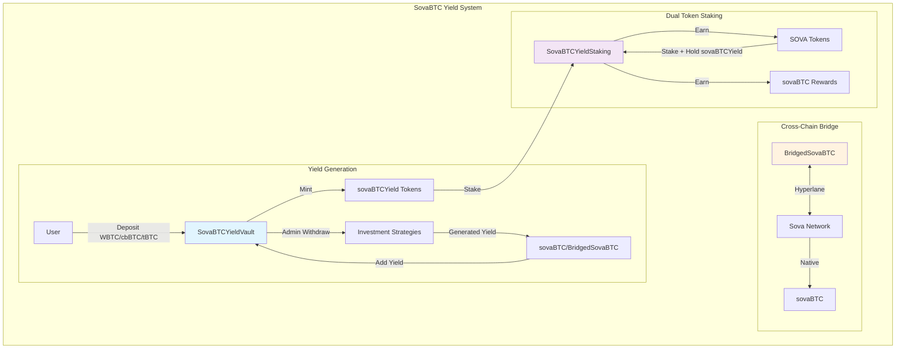

# SovaBTC Yield System

A comprehensive Bitcoin yield generation platform built for multi-chain deployment across Ethereum, Base, and Sova Network. The system enables users to deposit various Bitcoin variants (WBTC, cbBTC, tBTC, native sovaBTC) into ERC-4626 compliant yield vaults and earn Bitcoin-denominated yields through professionally managed investment strategies.

## 🚀 Overview

The SovaBTC Yield System consists of three core components that work together to provide a seamless Bitcoin yield experience:

- **🏦 SovaBTCYieldVault**: ERC-4626 compliant vault accepting multiple Bitcoin variants
- **🔗 BridgedSovaBTC**: Cross-chain sovaBTC token via Hyperlane protocol  
- **🥩 SovaBTCYieldStaking**: Dual token staking system with symbiotic rewards

### Key Features

- **Multi-Asset Support**: Accept WBTC, cbBTC, tBTC, and native sovaBTC
- **Professional Yield Generation**: Admin-managed investment strategies
- **Cross-Chain Distribution**: Native sovaBTC on Sova, bridged tokens elsewhere
- **Dual Token Staking**: Symbiotic staking rewards (sovaBTCYield → SOVA → sovaBTC)
- **Network-Aware Deployment**: Optimized for each target network
- **Enterprise Security**: Role-based access control, pausability, upgradeability

## 🏗️ System Architecture



## 📋 Core Contracts

### 1. SovaBTCYieldVault.sol
**ERC-4626 Compliant Yield Vault**

Multi-asset Bitcoin yield generation vault with professional investment strategy integration.

**Key Features:**
- ERC-4626 standard compliance with multi-asset support
- Decimal normalization for 6, 8, and 18 decimal assets
- Dynamic exchange rate tracking yield accumulation
- Admin-controlled asset withdrawal for investment strategies
- Network-aware reward token integration

**Critical Functions:**
```solidity
// Multi-asset deposit with automatic decimal normalization
function depositAsset(address asset, uint256 amount, address receiver) external returns (uint256 shares);

// Redeem vault shares for sovaBTC/BridgedSovaBTC rewards
function redeemForRewards(uint256 shares, address receiver) external returns (uint256 rewardAmount);

// Admin functions for investment strategy management
function adminWithdraw(address asset, uint256 amount, address destination) external onlyOwner;
function addYield(uint256 rewardAmount) external onlyOwner;
```

### 2. BridgedSovaBTC.sol
**Cross-Chain sovaBTC Token via Hyperlane**

Canonical sovaBTC representation on non-Sova networks using Hyperlane's burn-and-mint bridge pattern.

**Key Features:**
- ERC-20 with 8 decimals (matching native sovaBTC)
- Hyperlane integration for secure cross-chain messaging
- Role-based access control (BRIDGE_ROLE, VAULT_ROLE)
- Burn-and-mint bridge model for total supply consistency

**Critical Functions:**
```solidity
// Bridge tokens from current chain to Sova Network
function bridgeToSova(address recipient, uint256 amount) external;

// Handle incoming cross-chain messages (called by Hyperlane Mailbox)
function handle(uint32 origin, bytes32 sender, bytes calldata body) external;

// Mint tokens for authorized roles (vault/bridge)
function mint(address to, uint256 amount) external;
```

### 3. SovaBTCYieldStaking.sol
**Dual Token Staking System**

Two-tier symbiotic staking system requiring both sovaBTCYield and SOVA tokens for maximum rewards.

**Key Features:**
- Level 1: Stake sovaBTCYield → Earn SOVA tokens
- Level 2: Stake SOVA + maintain sovaBTCYield stake → Earn sovaBTC
- Lock periods with reward multipliers (1.0x to 2.0x)
- Dual staking bonus (+20% for holding both tokens)
- Emergency unstaking with penalties

**Critical Functions:**
```solidity
// Stake vault tokens to earn SOVA
function stakeVaultTokens(uint256 amount, uint256 lockPeriod) external;

// Stake SOVA to earn sovaBTC (requires vault tokens staked)
function stakeSova(uint256 amount, uint256 lockPeriod) external;

// Claim all accumulated rewards
function claimRewards() external;
```

## 🔗 Hyperlane Integration

The system uses **Hyperlane** as its cross-chain messaging protocol for secure sovaBTC bridging between networks.

### Architecture Design

The integration follows Hyperlane's **burn-and-mint bridge** pattern:

1. **Outbound Flow**: User calls `bridgeToSova()` → tokens burned → Hyperlane message dispatched → native sovaBTC minted on Sova
2. **Inbound Flow**: Sova network burns native sovaBTC → Hyperlane message → BridgedSovaBTC minted on destination chain

### Message Flow Specification

```solidity
// Outbound: Bridge to Sova Network
function bridgeToSova(address recipient, uint256 amount) external {
    _burn(msg.sender, amount);                                    // Burn tokens locally
    bytes memory message = abi.encode(recipient, amount);         // Encode message
    IHyperlaneMailbox(hyperlaneMailbox).dispatch(
        SOVA_DOMAIN,                                             // Destination domain
        addressToBytes32(SOVA_NETWORK_SOVABTC),                 // Target contract
        message                                                  // Message payload
    );
}

// Inbound: Handle messages from Hyperlane
function handle(uint32 origin, bytes32 sender, bytes calldata body) external {
    require(msg.sender == hyperlaneMailbox, "Invalid mailbox");  // Validate caller
    (address recipient, uint256 amount) = abi.decode(body, (address, uint256));
    _mint(recipient, amount);                                    // Mint tokens
}
```

### Security Model

- **Mailbox Validation**: Only configured Hyperlane Mailbox can call `handle()`
- **Message Authentication**: Hyperlane's cryptographic validation ensures message integrity
- **Domain Isolation**: Hardcoded domain IDs prevent cross-chain confusion
- **Role-Based Access**: BRIDGE_ROLE restricts minting to authorized relayers
- **Burn-and-Mint Consistency**: Maintains total supply consistency across all chains

## 🌐 Network Deployment

### Supported Networks

| Network | Primary Asset | Reward Token | Deployment Status |
|---------|--------------|--------------|-------------------|
| **Ethereum** | WBTC | BridgedSovaBTC | ✅ Ready |
| **Base** | cbBTC | BridgedSovaBTC | ✅ Ready |
| **Sova Network** | Native sovaBTC | Native sovaBTC | ✅ Ready |

### Network-Aware Configuration

The deployment script automatically configures contracts based on the target network:

```bash
# Deploy to Ethereum Mainnet
forge script script/DeploySovaBTCYieldSystem.s.sol --rpc-url $ETHEREUM_RPC_URL --broadcast --verify

# Deploy to Base
forge script script/DeploySovaBTCYieldSystem.s.sol --rpc-url $BASE_RPC_URL --broadcast --verify

# Deploy to Sova Network  
forge script script/DeploySovaBTCYieldSystem.s.sol --rpc-url $SOVA_RPC_URL --broadcast --verify
```

## 🛠️ Development Setup

### Prerequisites

- [Foundry](https://getfoundry.sh/) (latest version)
- Node.js 16+ and npm
- Git

### Installation

```bash
git clone https://github.com/SovaNetwork/sovabtc-yield.git
cd sovabtc-yield
make setup
```

### Environment Configuration

1. Copy environment template:
```bash
cp .env.example .env
```

2. Configure your `.env` file:
```bash
# Deployment Configuration
PRIVATE_KEY=your_private_key_here
OWNER_ADDRESS=0x...

# Network RPC URLs
ETHEREUM_RPC_URL=https://mainnet.infura.io/v3/your-key
BASE_RPC_URL=https://mainnet.base.org
SOVA_RPC_URL=https://rpc.sova.network

# Token Addresses
SOVA_TOKEN_ADDRESS=0x...

# Hyperlane Mailbox Addresses
HYPERLANE_MAILBOX_MAINNET=0x...
HYPERLANE_MAILBOX_BASE=0x...
```

## 🧪 Testing

### Comprehensive Test Suite

The project includes **92 tests** with excellent coverage:

- **SovaBTCYieldVault**: 95%+ coverage
- **SovaBTCYieldStaking**: 84%+ coverage  
- **BridgedSovaBTC**: 86%+ coverage

### Running Tests

```bash
# Run all tests
make test

# Run specific test suites
forge test --match-contract SovaBTCYieldSystemTest
forge test --match-contract SovaBTCYieldStakingTest

# Generate detailed coverage report
make coverage

# Run tests with gas reporting
make gas-report
```

## 🔒 Security & Risk Management

### Access Control Architecture

**Role-Based Permissions:**
- **SovaBTCYieldVault**: Owner-only functions for asset management and yield distribution
- **BridgedSovaBTC**: Multi-role system (ADMIN, BRIDGE, VAULT, UPGRADER roles)
- **SovaBTCYieldStaking**: Owner-controlled reward rates and funding

### Emergency Controls

- **Pausability**: All contracts can be paused in emergencies
- **Emergency Unstaking**: Users can exit stakes with penalty if needed
- **Upgrade Controls**: UUPS proxy pattern with admin controls

### Security Features

- **Reentrancy Protection**: All external interactions protected
- **Input Validation**: Comprehensive zero-address and zero-amount checks
- **Decimal Normalization**: Prevents precision loss and overflow attacks
- **Cross-Chain Security**: Hyperlane's cryptographic message validation

## 📊 Usage Examples

### For Users

**Deposit Bitcoin Variants:**
```solidity
// Approve and deposit WBTC
IERC20(wbtc).approve(vaultAddress, amount);
uint256 shares = vault.depositAsset(wbtc, amount, msg.sender);
```

**Stake for Rewards:**
```solidity
// 1. Stake vault tokens to earn SOVA
vault.approve(stakingAddress, shares);
staking.stakeVaultTokens(shares, lockPeriod);

// 2. Stake SOVA to earn sovaBTC (requires vault tokens staked)
sova.approve(stakingAddress, sovaAmount);
staking.stakeSova(sovaAmount, lockPeriod);

// 3. Claim rewards
staking.claimRewards();
```

### For Admins

**Manage Yield Generation:**
```solidity
// Withdraw assets for investment strategies
vault.adminWithdraw(asset, amount, destination);

// Add generated yield back to vault
sovaBTC.approve(vaultAddress, yieldAmount);
vault.addYield(yieldAmount);
```

## 🏛️ Architecture Decisions

### Why Separate Repository?

This system is architecturally independent from Sova Network's core infrastructure:

- **Different Purpose**: DeFi yield product vs. network infrastructure
- **Independent Deployment**: Multi-chain vs. single network focus  
- **Different Audiences**: DeFi users vs. network validators
- **Release Cycles**: Product features vs. network upgrades

### Design Principles

1. **ERC-4626 Compliance**: Standard vault interface for DeFi composability
2. **Multi-Asset Support**: Maximize Bitcoin variant accessibility
3. **Cross-Chain Native**: Built for multi-network deployment from day one  
4. **Professional Management**: Admin-controlled investment strategies
5. **Security First**: Comprehensive access controls and emergency mechanisms

## 📚 Documentation

- [Technical Specification](./TECHNICAL_SPEC.md) - Detailed technical implementation
- [Deployment Guide](./docs/deployment.md) - Step-by-step deployment instructions
- [Integration Guide](./docs/integration.md) - How to integrate with your dApp
- [Security Audit](./docs/security.md) - Security considerations and audit results

## 🤝 Contributing

1. Fork the repository
2. Create a feature branch (`git checkout -b feature/amazing-feature`)
3. Run tests (`make test`)
4. Ensure code formatting (`make format`)
5. Commit changes (`git commit -m 'Add amazing feature'`)
6. Push to branch (`git push origin feature/amazing-feature`)
7. Open a Pull Request

## 📄 License

This project is licensed under the MIT License - see the [LICENSE](LICENSE) file for details.

## 🔗 Links

- [Sova Network](https://sova.network)
- [Documentation](https://docs.sova.network)
- [Discord Community](https://discord.gg/sova)
- [Twitter](https://twitter.com/SovaNetwork)

---

**Built with ❤️ by the Sova Network team**