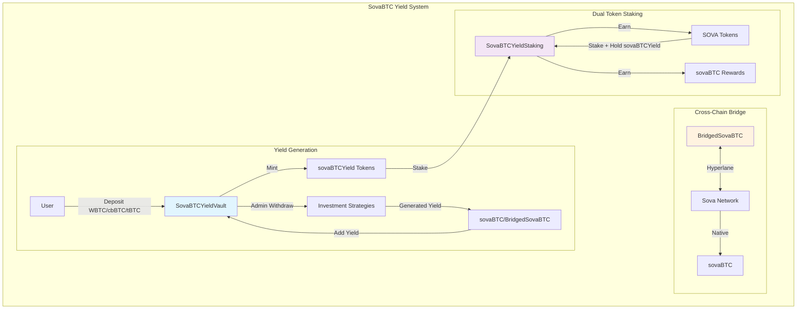

# SovaBTC Yield System

A comprehensive Bitcoin yield generation platform built for multi-chain deployment across Ethereum, Base, and Sova Network. The system enables users to deposit various Bitcoin variants (WBTC, cbBTC, tBTC, native sovaBTC) into ERC-4626 compliant yield vaults and earn Bitcoin-denominated yields through professionally managed investment strategies.

## 📋 Table of Contents

- [🚀 Overview](#-overview)
- [🏗️ System Architecture](#️-system-architecture)
- [📋 Core Contracts](#-core-contracts)
  - [1. SovaBTCYieldVault.sol](#1-sovabtcyieldvaultsol)
  - [2. BridgedSovaBTC.sol](#2-bridgedsovabtcsol)
  - [3. SovaBTCYieldStaking.sol](#3-sovabtcyieldstakingsol)
- [🔗 Hyperlane Integration](#-hyperlane-integration)
- [💰 Multi-Asset Collateral Support](#-multi-asset-collateral-support)
- [🌐 Network Deployment](#-network-deployment)
- [🛠️ Development Setup](#️-development-setup)
- [🧪 Testing](#-testing)
- [🔒 Security & Risk Management](#-security--risk-management)
- [📊 Usage Examples](#-usage-examples)
- [🏛️ Architecture Decisions](#️-architecture-decisions)
- [📚 Documentation](#-documentation)
- [🤝 Contributing](#-contributing)
- [📄 License](#-license)
- [🔗 Links](#-links)

## 🚀 Overview

The SovaBTC Yield System consists of three core components that work together to provide a seamless Bitcoin yield experience:

- **🏦 SovaBTCYieldVault**: ERC-4626 compliant vault accepting multiple Bitcoin variants
- **🔗 BridgedSovaBTC**: Cross-chain sovaBTC token via Hyperlane protocol  
- **🥩 SovaBTCYieldStaking**: Dual token staking system with symbiotic rewards

### Key Features

- **Multi-Asset Support**: Accept WBTC, cbBTC, tBTC, and native sovaBTC
- **Professional Yield Generation**: Admin-managed investment strategies
- **Cross-Chain Distribution**: Native sovaBTC on Sova, bridged tokens elsewhere
- **Dual Token Staking**: Symbiotic staking rewards (sovaBTCYield → SOVA → sovaBTC)
- **Network-Aware Deployment**: Optimized for each target network
- **Enterprise Security**: Role-based access control, pausability, upgradeability

## 🏗️ System Architecture



## 📋 Core Contracts

### 1. SovaBTCYieldVault.sol
**ERC-4626 Compliant Yield Vault**

Multi-asset Bitcoin yield generation vault with professional investment strategy integration.

**Key Features:**
- ERC-4626 standard compliance with multi-asset support
- Decimal normalization for 6, 8, and 18 decimal assets
- Dynamic exchange rate tracking yield accumulation
- Admin-controlled asset withdrawal for investment strategies
- Network-aware reward token integration

**Critical Functions:**
```solidity
// Multi-asset deposit with automatic decimal normalization
function depositAsset(address asset, uint256 amount, address receiver) external returns (uint256 shares);

// Redeem vault shares for sovaBTC/BridgedSovaBTC rewards
function redeemForRewards(uint256 shares, address receiver) external returns (uint256 rewardAmount);

// Admin functions for investment strategy management
function adminWithdraw(address asset, uint256 amount, address destination) external onlyOwner;
function addYield(uint256 rewardAmount) external onlyOwner;
```

### 2. BridgedSovaBTC.sol
**Cross-Chain sovaBTC Token via Hyperlane**

Canonical sovaBTC representation on non-Sova networks using Hyperlane's burn-and-mint bridge pattern.

**Key Features:**
- ERC-20 with 8 decimals (matching native sovaBTC)
- Hyperlane integration for secure cross-chain messaging
- Role-based access control (BRIDGE_ROLE, VAULT_ROLE)
- Burn-and-mint bridge model for total supply consistency

**Critical Functions:**
```solidity
// Bridge tokens from current chain to Sova Network
function bridgeToSova(address recipient, uint256 amount) external;

// Handle incoming cross-chain messages (called by Hyperlane Mailbox)
function handle(uint32 origin, bytes32 sender, bytes calldata body) external;

// Mint tokens for authorized roles (vault/bridge)
function mint(address to, uint256 amount) external;
```

### 3. SovaBTCYieldStaking.sol
**Dual Token Staking System**

Two-tier symbiotic staking system requiring both sovaBTCYield and SOVA tokens for maximum rewards.

**Key Features:**
- Level 1: Stake sovaBTCYield → Earn SOVA tokens
- Level 2: Stake SOVA + maintain sovaBTCYield stake → Earn sovaBTC
- Lock periods with reward multipliers (1.0x to 2.0x)
- Dual staking bonus (+20% for holding both tokens)
- Emergency unstaking with penalties

**Critical Functions:**
```solidity
// Stake vault tokens to earn SOVA
function stakeVaultTokens(uint256 amount, uint256 lockPeriod) external;

// Stake SOVA to earn sovaBTC (requires vault tokens staked)
function stakeSova(uint256 amount, uint256 lockPeriod) external;

// Claim all accumulated rewards
function claimRewards() external;
```

## 🔗 Hyperlane Integration

The system uses **Hyperlane** as its cross-chain messaging protocol for secure sovaBTC bridging between networks.

### Architecture Design

The integration follows Hyperlane's **burn-and-mint bridge** pattern:

1. **Outbound Flow**: User calls `bridgeToSova()` → tokens burned → Hyperlane message dispatched → native sovaBTC minted on Sova
2. **Inbound Flow**: Sova network burns native sovaBTC → Hyperlane message → BridgedSovaBTC minted on destination chain

### Message Flow Specification

```solidity
// Outbound: Bridge to Sova Network
function bridgeToSova(address recipient, uint256 amount) external {
    _burn(msg.sender, amount);                                    // Burn tokens locally
    bytes memory message = abi.encode(recipient, amount);         // Encode message
    IHyperlaneMailbox(hyperlaneMailbox).dispatch(
        SOVA_DOMAIN,                                             // Destination domain
        addressToBytes32(SOVA_NETWORK_SOVABTC),                 // Target contract
        message                                                  // Message payload
    );
}

// Inbound: Handle messages from Hyperlane
function handle(uint32 origin, bytes32 sender, bytes calldata body) external {
    require(msg.sender == hyperlaneMailbox, "Invalid mailbox");  // Validate caller
    (address recipient, uint256 amount) = abi.decode(body, (address, uint256));
    _mint(recipient, amount);                                    // Mint tokens
}
```

### Security Model

- **Mailbox Validation**: Only configured Hyperlane Mailbox can call `handle()`
- **Message Authentication**: Hyperlane's cryptographic validation ensures message integrity
- **Domain Isolation**: Hardcoded domain IDs prevent cross-chain confusion
- **Role-Based Access**: BRIDGE_ROLE restricts minting to authorized relayers
- **Burn-and-Mint Consistency**: Maintains total supply consistency across all chains

## 💰 Multi-Asset Collateral Support

### Overview

The SovaBTCYieldVault is designed as a **multi-asset yield vault** that can accept various Bitcoin-backed tokens as collateral on each network. This design maximizes capital efficiency and provides users with flexibility in their Bitcoin holdings while generating unified yield.

### Supported Bitcoin Variants

Each vault deployment can support multiple Bitcoin-backed assets simultaneously:

| Network | Supported Assets | Status | Contract Addresses |
|---------|-----------------|--------|-------------------|
| **Ethereum** | WBTC, cbBTC, tBTC, BTCB | ✅ Ready | WBTC: `0x2260FAC5E5542a773Aa44fBCfeDf7C193bc2C599` |
| **Base** | cbBTC, tBTC, WBTC (bridged) | ✅ Ready | cbBTC: `0xcbB7C0000aB88B473b1f5aFd9ef808440eed33Bf` |
| **Sova Network** | Native sovaBTC, WBTC (bridged), cbBTC (bridged) | ✅ Ready | sovaBTC: `0x2100000000000000000000000000000000000020` |
| **Arbitrum** | WBTC, tBTC, cbBTC | 🔄 Planned | Coming Soon |
| **Polygon** | WBTC, tBTC | 🔄 Planned | Coming Soon |

### Asset Management Architecture

#### Decimal Normalization System

The vault automatically handles different decimal precisions across Bitcoin variants:

```solidity
// Automatic decimal normalization to 8 decimals (Bitcoin standard)
function _normalizeAmount(address asset, uint256 amount) internal view returns (uint256) {
    uint8 assetDecimals = IERC20Metadata(asset).decimals();
    uint8 targetDecimals = 8; // Bitcoin precision
    
    if (assetDecimals == targetDecimals) {
        return amount;
    } else if (assetDecimals > targetDecimals) {
        // Downscale (e.g., 18 decimals tBTC → 8 decimals)
        uint256 divisor = 10 ** (assetDecimals - targetDecimals);
        require(amount % divisor == 0, "Precision loss prevented");
        return amount / divisor;
    } else {
        // Upscale (e.g., 6 decimals → 8 decimals)
        return amount * (10 ** (targetDecimals - assetDecimals));
    }
}
```

#### Supported Decimal Configurations

| Asset Type | Decimals | Example Tokens | Normalization |
|------------|----------|----------------|---------------|
| **8 Decimals** | 8 | WBTC, cbBTC, sovaBTC | Direct (no conversion) |
| **18 Decimals** | 18 | tBTC | Downscale to 8 decimals |
| **6 Decimals** | 6 | USDC-backed BTC (future) | Upscale to 8 decimals |

### Adding New Collateral Types

#### 1. Admin Function for Asset Addition

```solidity
/**
 * @notice Add a new supported Bitcoin variant to the vault
 * @param asset The ERC20 token address of the Bitcoin variant
 * @param name Human-readable name for the asset (e.g., "Wrapped Bitcoin")
 */
function addSupportedAsset(address asset, string memory name) external onlyOwner {
    require(asset != address(0), "Zero address");
    require(!supportedAssets[asset], "Asset already supported");
    require(IERC20Metadata(asset).decimals() <= 18, "Too many decimals");
    
    supportedAssets[asset] = true;
    supportedAssetsList.push(asset);
    
    emit AssetAdded(asset, name);
}
```

#### 2. Step-by-Step Addition Process

**For Network Administrators:**

```bash
# 1. Verify the token contract and decimals
cast call <TOKEN_ADDRESS> "decimals()" --rpc-url <NETWORK_RPC>
cast call <TOKEN_ADDRESS> "symbol()" --rpc-url <NETWORK_RPC>
cast call <TOKEN_ADDRESS> "name()" --rpc-url <NETWORK_RPC>

# 2. Add the asset to the vault
cast send <VAULT_ADDRESS> "addSupportedAsset(address,string)" \
    <TOKEN_ADDRESS> "Token Name" \
    --private-key <ADMIN_KEY> --rpc-url <NETWORK_RPC>

# 3. Verify addition
cast call <VAULT_ADDRESS> "isAssetSupported(address)" <TOKEN_ADDRESS> --rpc-url <NETWORK_RPC>
```

#### 3. Asset Validation Requirements

Before adding a new Bitcoin variant, ensure:

- ✅ **ERC20 Compliance**: Standard ERC20 interface implementation
- ✅ **Bitcoin Backing**: 1:1 or verifiable backing with Bitcoin
- ✅ **Liquidity**: Sufficient on-chain liquidity for large redemptions
- ✅ **Security Audit**: Professional security audit of the token contract
- ✅ **Decimal Support**: 6, 8, or 18 decimals (automatically handled)
- ✅ **Rebase Protection**: No rebasing or deflationary mechanisms

### Multi-Asset Deposit Flow

#### User Experience

Users can deposit any supported Bitcoin variant in a single transaction:

```solidity
// Example: User deposits WBTC on Ethereum
function depositAsset(address asset, uint256 amount, address receiver) 
    external returns (uint256 shares) 
{
    require(supportedAssets[asset], "Asset not supported");
    
    // 1. Transfer asset from user
    IERC20(asset).safeTransferFrom(msg.sender, address(this), amount);
    
    // 2. Normalize to 8 decimals
    uint256 normalizedAmount = _normalizeAmount(asset, amount);
    
    // 3. Calculate shares based on current exchange rate
    uint256 shares = _calculateShares(normalizedAmount);
    
    // 4. Mint sovaBTCYield tokens to user
    _mint(receiver, shares);
    
    emit AssetDeposited(msg.sender, asset, amount, shares);
    return shares;
}
```

#### Unified Accounting

All assets are normalized to 8-decimal Bitcoin precision for unified accounting:

```solidity
// Total assets calculation across all supported types
function totalAssets() public view override returns (uint256) {
    uint256 total = 0;
    
    for (uint256 i = 0; i < supportedAssetsList.length; i++) {
        address asset = supportedAssetsList[i];
        uint256 balance = IERC20(asset).balanceOf(address(this));
        total += _normalizeAmount(asset, balance);
    }
    
    return total + assetsUnderManagement;
}
```

### Asset Management Features

#### 1. Asset Enumeration

```solidity
// Get all supported assets
function getSupportedAssets() external view returns (address[] memory) {
    return supportedAssetsList;
}

// Get asset information
function getAssetInfo(address asset) external view returns (
    bool isSupported,
    string memory name,
    uint8 decimals,
    uint256 balance
) {
    isSupported = supportedAssets[asset];
    if (isSupported) {
        IERC20Metadata token = IERC20Metadata(asset);
        name = token.name();
        decimals = token.decimals();
        balance = token.balanceOf(address(this));
    }
}
```

#### 2. Asset-Specific Analytics

Track deposits and performance by asset type:

```solidity
// Asset-specific tracking
mapping(address => uint256) public assetTotalDeposited;
mapping(address => uint256) public assetCurrentBalance;

// Update on each deposit
function _trackAssetDeposit(address asset, uint256 amount) internal {
    assetTotalDeposited[asset] += amount;
    assetCurrentBalance[asset] = IERC20(asset).balanceOf(address(this));
}
```

#### 3. Investment Strategy Allocation

Admin can withdraw any supported asset for investment strategies:

```solidity
/**
 * @notice Withdraw specific asset for investment strategies
 * @param asset The Bitcoin variant to withdraw
 * @param amount Amount in asset's native decimals
 * @param destination Investment strategy contract address
 */
function adminWithdraw(address asset, uint256 amount, address destination) 
    external onlyOwner 
{
    require(supportedAssets[asset], "Asset not supported");
    require(IERC20(asset).balanceOf(address(this)) >= amount, "Insufficient balance");
    
    // Update tracking
    uint256 normalizedAmount = _normalizeAmount(asset, amount);
    assetsUnderManagement += normalizedAmount;
    
    // Transfer to investment strategy
    IERC20(asset).safeTransfer(destination, amount);
    
    emit AdminWithdrawal(asset, amount, destination);
}
```

### Network-Specific Asset Strategies

#### Ethereum Mainnet Strategy
- **Primary**: WBTC (highest liquidity)
- **Secondary**: cbBTC (institutional grade)
- **Alternative**: tBTC (decentralized)
- **Future**: Additional institutional Bitcoin products

#### Base Network Strategy
- **Primary**: cbBTC (native Coinbase integration)
- **Secondary**: tBTC (cross-chain from Ethereum)
- **Alternative**: Bridged WBTC
- **Future**: Base-native Bitcoin products

#### Sova Network Strategy
- **Primary**: Native sovaBTC (direct Bitcoin backing)
- **Secondary**: Bridged major Bitcoin variants
- **Integration**: Direct Bitcoin precompile access
- **Future**: Bitcoin L2 integrations

### Security Considerations for Multi-Asset Support

#### Asset Risk Assessment

Each asset undergoes evaluation:

1. **Smart Contract Risk**: Audit quality and upgrade mechanisms
2. **Custody Risk**: Bitcoin backing and custodial security
3. **Liquidity Risk**: On-chain and off-chain liquidity depth
4. **Regulatory Risk**: Compliance and regulatory standing
5. **Technical Risk**: Integration complexity and edge cases

#### Risk Mitigation Strategies

```solidity
// Asset-specific limits and controls
mapping(address => uint256) public assetDepositCaps;
mapping(address => bool) public assetPaused;

function setAssetDepositCap(address asset, uint256 cap) external onlyOwner {
    require(supportedAssets[asset], "Asset not supported");
    assetDepositCaps[asset] = cap;
}

function pauseAsset(address asset) external onlyOwner {
    require(supportedAssets[asset], "Asset not supported");
    assetPaused[asset] = true;
}
```

### Future Expansion Opportunities

#### Layer 2 Bitcoin Solutions
- **Lightning Network**: Integration with Lightning-backed tokens
- **Bitcoin L2s**: Support for emerging Bitcoin Layer 2 solutions
- **Liquid Network**: L-BTC integration for institutional users

#### Institutional Products
- **ETFs**: Bitcoin ETF token integrations
- **Bank Products**: Traditional finance Bitcoin products
- **Custody Solutions**: Enterprise-grade Bitcoin custodial tokens

#### Cross-Chain Expansion
- **Additional Networks**: Polygon, Avalanche, Fantom support
- **Hyperlane Growth**: New chains as Hyperlane expands
- **Interoperability**: Integration with other bridge protocols

This multi-asset architecture provides maximum flexibility while maintaining security and unified yield generation across all supported Bitcoin variants.

## 🌐 Network Deployment

### Supported Networks

| Network | Primary Asset | Additional Assets | Reward Token | Deployment Status |
|---------|--------------|------------------|--------------|-------------------|
| **Ethereum** | WBTC | cbBTC, tBTC, BTCB | BridgedSovaBTC | ✅ Ready |
| **Base** | cbBTC | tBTC, WBTC (bridged) | BridgedSovaBTC | ✅ Ready |
| **Sova Network** | Native sovaBTC | WBTC, cbBTC (bridged) | Native sovaBTC | ✅ Ready |

### Network-Aware Configuration

The deployment script automatically configures contracts based on the target network:

```bash
# Deploy to Ethereum Mainnet
forge script script/DeploySovaBTCYieldSystem.s.sol --rpc-url $ETHEREUM_RPC_URL --broadcast --verify

# Deploy to Base
forge script script/DeploySovaBTCYieldSystem.s.sol --rpc-url $BASE_RPC_URL --broadcast --verify

# Deploy to Sova Network  
forge script script/DeploySovaBTCYieldSystem.s.sol --rpc-url $SOVA_RPC_URL --broadcast --verify
```

## 🛠️ Development Setup

### Prerequisites

- [Foundry](https://getfoundry.sh/) (latest version)
- Node.js 16+ and npm
- Git

### Installation

```bash
git clone https://github.com/SovaNetwork/sovabtc-yield.git
cd sovabtc-yield
make setup
```

### Environment Configuration

1. Copy environment template:
```bash
cp .env.example .env
```

2. Configure your `.env` file:
```bash
# Deployment Configuration
PRIVATE_KEY=your_private_key_here
OWNER_ADDRESS=0x...

# Network RPC URLs
ETHEREUM_RPC_URL=https://mainnet.infura.io/v3/your-key
BASE_RPC_URL=https://mainnet.base.org
SOVA_RPC_URL=https://rpc.sova.network

# Token Addresses
SOVA_TOKEN_ADDRESS=0x...

# Hyperlane Mailbox Addresses
HYPERLANE_MAILBOX_MAINNET=0x...
HYPERLANE_MAILBOX_BASE=0x...
```

## 🧪 Testing

### Comprehensive Test Suite

The project includes **92 tests** with excellent coverage:

- **SovaBTCYieldVault**: 95%+ coverage
- **SovaBTCYieldStaking**: 84%+ coverage  
- **BridgedSovaBTC**: 86%+ coverage

### Running Tests

```bash
# Run all tests
make test

# Run specific test suites
forge test --match-contract SovaBTCYieldSystemTest
forge test --match-contract SovaBTCYieldStakingTest

# Generate detailed coverage report
make coverage

# Run tests with gas reporting
make gas-report
```

## 🔒 Security & Risk Management

### Access Control Architecture

**Role-Based Permissions:**
- **SovaBTCYieldVault**: Owner-only functions for asset management and yield distribution
- **BridgedSovaBTC**: Multi-role system (ADMIN, BRIDGE, VAULT, UPGRADER roles)
- **SovaBTCYieldStaking**: Owner-controlled reward rates and funding

### Emergency Controls

- **Pausability**: All contracts can be paused in emergencies
- **Emergency Unstaking**: Users can exit stakes with penalty if needed
- **Upgrade Controls**: UUPS proxy pattern with admin controls

### Security Features

- **Reentrancy Protection**: All external interactions protected
- **Input Validation**: Comprehensive zero-address and zero-amount checks
- **Decimal Normalization**: Prevents precision loss and overflow attacks
- **Cross-Chain Security**: Hyperlane's cryptographic message validation

## 📊 Usage Examples

### For Users

**Deposit Bitcoin Variants:**
```solidity
// Approve and deposit WBTC
IERC20(wbtc).approve(vaultAddress, amount);
uint256 shares = vault.depositAsset(wbtc, amount, msg.sender);
```

**Stake for Rewards:**
```solidity
// 1. Stake vault tokens to earn SOVA
vault.approve(stakingAddress, shares);
staking.stakeVaultTokens(shares, lockPeriod);

// 2. Stake SOVA to earn sovaBTC (requires vault tokens staked)
sova.approve(stakingAddress, sovaAmount);
staking.stakeSova(sovaAmount, lockPeriod);

// 3. Claim rewards
staking.claimRewards();
```

### For Admins

**Manage Yield Generation:**
```solidity
// Withdraw assets for investment strategies
vault.adminWithdraw(asset, amount, destination);

// Add generated yield back to vault
sovaBTC.approve(vaultAddress, yieldAmount);
vault.addYield(yieldAmount);
```

## 🏛️ Architecture Decisions

### Why Separate Repository?

This system is architecturally independent from Sova Network's core infrastructure:

- **Different Purpose**: DeFi yield product vs. network infrastructure
- **Independent Deployment**: Multi-chain vs. single network focus  
- **Different Audiences**: DeFi users vs. network validators
- **Release Cycles**: Product features vs. network upgrades

### Design Principles

1. **ERC-4626 Compliance**: Standard vault interface for DeFi composability
2. **Multi-Asset Support**: Maximize Bitcoin variant accessibility
3. **Cross-Chain Native**: Built for multi-network deployment from day one  
4. **Professional Management**: Admin-controlled investment strategies
5. **Security First**: Comprehensive access controls and emergency mechanisms

## 📚 Documentation

- [Technical Specification](./TECHNICAL_SPEC.md) - Detailed technical implementation
- [Deployment Guide](./docs/deployment.md) - Step-by-step deployment instructions
- [Integration Guide](./docs/integration.md) - How to integrate with your dApp
- [Security Audit](./docs/security.md) - Security considerations and audit results

## 🤝 Contributing

1. Fork the repository
2. Create a feature branch (`git checkout -b feature/amazing-feature`)
3. Run tests (`make test`)
4. Ensure code formatting (`make format`)
5. Commit changes (`git commit -m 'Add amazing feature'`)
6. Push to branch (`git push origin feature/amazing-feature`)
7. Open a Pull Request

## 📄 License

This project is licensed under the MIT License - see the [LICENSE](LICENSE) file for details.

## 🔗 Links

- [Sova Network](https://sova.network)
- [Documentation](https://docs.sova.network)
- [Discord Community](https://discord.gg/sova)
- [Twitter](https://twitter.com/SovaNetwork)

---

**Built with ❤️ by the Sova Network team**