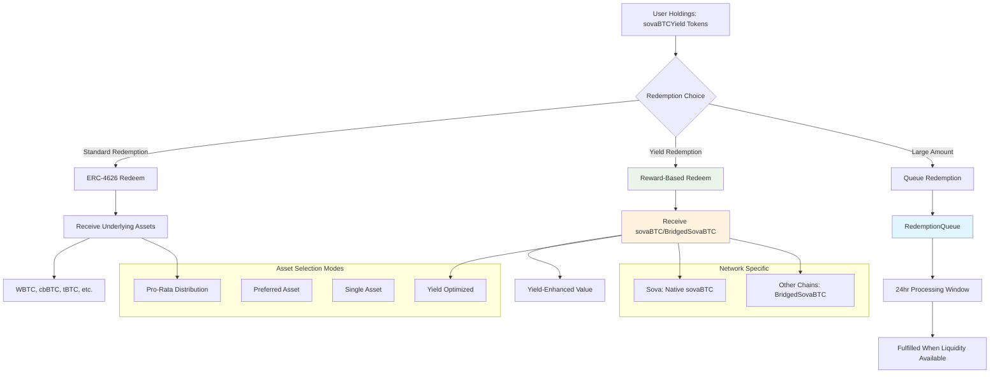

# Redemption System

> **Last Updated:** July 29, 2025

This document details the flexible redemption mechanisms in the SovaBTC Yield System, including standard ERC-4626 redemptions, yield-optimized redemptions, and the configurable queue system for liquidity management.

## Table of Contents

- [Overview](#overview)
- [Redemption Architecture](#redemption-architecture)
- [Redemption Types](#redemption-types)
- [Queue-Based Redemption System](#queue-based-redemption-system)
- [Redemption Configuration](#redemption-configuration)
- [Liquidity Management](#liquidity-management)
- [Network-Specific Behavior](#network-specific-behavior)
- [Emergency Redemption Features](#emergency-redemption-features)
- [Analytics & Monitoring](#analytics--monitoring)

## Overview

The SovaBTC Yield System provides **flexible redemption mechanisms** that allow users to exit their positions in multiple ways, each optimized for different use cases. The system supports both **standard ERC-4626 redemptions** for underlying assets and **yield-optimized redemptions** for sovaBTC rewards.

### Core Redemption Features

1. **Standard ERC-4626 Redemption**: Exchange vault shares for underlying Bitcoin assets
2. **Yield-Optimized Redemption**: Exchange vault shares for sovaBTC rewards at enhanced rates
3. **Configurable Queue System**: Manage large redemptions with liquidity windows
4. **Multi-Asset Distribution**: Flexible asset allocation during redemption
5. **Emergency Controls**: Circuit breakers and emergency redemption mechanisms

## Redemption Architecture



## Redemption Types

### 1. Standard ERC-4626 Redemption

**Purpose**: Exchange vault shares for underlying Bitcoin assets

**Implementation**:
```solidity
function redeem(uint256 shares, address receiver, address owner) 
    external 
    returns (uint256 assets) 
{
    // Validate redemption
    require(shares > 0, "Zero shares");
    require(receiver != address(0), "Zero address");
    
    // Check allowance if not owner
    if (msg.sender != owner) {
        uint256 allowed = allowance(owner, msg.sender);
        require(allowed >= shares, "Insufficient allowance");
        _approve(owner, msg.sender, allowed - shares);
    }
    
    // Calculate asset amount
    assets = convertToAssets(shares);
    require(assets > 0, "Zero assets");
    
    // Burn shares
    _burn(owner, shares);
    
    // Distribute underlying assets
    _distributeUnderlyingAssets(receiver, assets);
    
    emit Withdraw(msg.sender, receiver, owner, assets, shares);
}
```

**Asset Distribution Logic**:
```solidity
function _distributeUnderlyingAssets(address receiver, uint256 totalAssets) internal {
    // Get available asset balances
    uint256 totalAvailable = 0;
    uint256[] memory balances = new uint256[](supportedAssetsList.length);
    
    for (uint256 i = 0; i < supportedAssetsList.length; i++) {
        address asset = supportedAssetsList[i];
        balances[i] = IERC20(asset).balanceOf(address(this));
        totalAvailable += _normalizeAmount(asset, balances[i]);
    }
    
    // Distribute pro-rata based on availability
    for (uint256 i = 0; i < supportedAssetsList.length; i++) {
        if (balances[i] > 0) {
            address asset = supportedAssetsList[i];
            uint256 normalizedBalance = _normalizeAmount(asset, balances[i]);
            uint256 shareOfTotal = normalizedBalance * totalAssets / totalAvailable;
            
            // Convert back to asset decimals and transfer
            uint256 assetAmount = _denormalizeAmount(asset, shareOfTotal);
            if (assetAmount > 0) {
                IERC20(asset).safeTransfer(receiver, assetAmount);
            }
        }
    }
}
```

### 2. Yield-Optimized Redemption

**Purpose**: Exchange vault shares for sovaBTC rewards at enhanced exchange rate

**Implementation**:
```solidity
function redeemForRewards(uint256 shares, address receiver) 
    external 
    returns (uint256 rewardAmount) 
{
    require(shares > 0, "Zero shares");
    require(receiver != address(0), "Zero address");
    require(balanceOf(msg.sender) >= shares, "Insufficient balance");
    
    // Calculate reward amount using exchange rate
    rewardAmount = shares * exchangeRate / EXCHANGE_RATE_PRECISION;
    require(rewardAmount > 0, "Zero rewards");
    
    // Check reward token availability
    require(rewardToken.balanceOf(address(this)) >= rewardAmount, "Insufficient rewards");
    
    // Burn vault shares
    _burn(msg.sender, shares);
    
    // Transfer reward tokens
    rewardToken.safeTransfer(receiver, rewardAmount);
    
    emit RewardTokensRedeemed(msg.sender, shares, rewardAmount);
}
```

**Exchange Rate Mechanism**:
```solidity
// Exchange rate increases as yield is added to the vault
// Initial rate: 1:1 (1e18 precision)
// After yield: rate = (totalAssets + accumulatedYield) / totalShares
function updateExchangeRate(uint256 yieldAdded) internal {
    if (totalSupply() > 0) {
        uint256 newTotalValue = totalAssets() + yieldAdded;
        exchangeRate = newTotalValue * EXCHANGE_RATE_PRECISION / totalSupply();
    }
}
```

## Queue-Based Redemption System

The RedemptionQueue contract manages queued redemptions with configurable windows and liquidity management for both vault shares and staking rewards.

### Queue Configuration

```solidity
struct QueueConfig {
    uint256 windowDuration;          // 24 hours default
    uint256 expirationDuration;      // 7 days default
    uint256 maxQueueSize;            // 1000 requests
    uint256 maxDailyVolume;          // 1000 BTC equivalent
    uint256 processingBatchSize;     // 50 requests per batch
    bool enabled;
}
```

### Redemption Request Process

```solidity
function requestQueuedRedemption(uint256 shares, address receiver) 
    external returns (bytes32 requestId) 
{
    require(shares >= minRedemptionAmount, "Below minimum");
    require(balanceOf(msg.sender) >= shares, "Insufficient balance");
    
    // Check if queue is needed (insufficient immediate liquidity)
    uint256 requiredAssets = convertToAssets(shares);
    if (_hasImmediateLiquidity(requiredAssets)) {
        // Process immediately if liquidity available
        return _processImmediateRedemption(shares, receiver);
    }
    
    // Add to queue if immediate liquidity insufficient
    requestId = redemptionQueue.requestRedemption(
        msg.sender,
        RedemptionQueue.RedemptionType.VaultShares,
        shares,
        address(0), // Any asset
        requiredAssets
    );
    
    // Lock shares by transferring to queue contract
    _transfer(msg.sender, address(redemptionQueue), shares);
    
    emit QueuedRedemptionRequested(msg.sender, requestId, shares);
}
```

### Queue Processing

```solidity
function fulfillQueuedRedemption(bytes32 requestId, address user, uint256 shares) 
    external returns (uint256 assets) 
{
    // Validate request can be processed
    require(_canProcessRequest(requestId), "Cannot process yet");
    
    // Calculate assets to distribute
    assets = convertToAssets(shares);
    
    // Execute redemption
    _executeRedemption(user, assets, RedemptionMode.ProRata);
    
    // Burn the locked shares
    _burn(address(this), shares);
    
    // Mark request as fulfilled
    redemptionQueue.markFulfilled(requestId);
    
    emit QueuedRedemptionFulfilled(requestId, user, shares, assets);
}
```

### Daily Volume Limits

```solidity
function _checkDailyVolumeLimit(uint256 redemptionAmount) internal {
    uint256 today = block.timestamp / 1 days;
    
    if (lastProcessingDay != today) {
        // Reset daily volume for new day
        dailyVolumeProcessed = 0;
        lastProcessingDay = today;
    }
    
    require(
        dailyVolumeProcessed + redemptionAmount <= config.maxDailyVolume,
        "Daily volume limit exceeded"
    );
    
    dailyVolumeProcessed += redemptionAmount;
}
```

## Redemption Configuration

### Admin Controls

```solidity
function setRedemptionConfig(
    uint256 _minRedemptionAmount,
    uint256 _redemptionFee,
    address _preferredAsset
) external onlyOwner {
    require(_redemptionFee <= MAX_REDEMPTION_FEE, "Fee too high"); // Max 2%
    require(_preferredAsset == address(0) || supportedAssets[_preferredAsset], "Invalid asset");
    
    minRedemptionAmount = _minRedemptionAmount;
    redemptionFee = _redemptionFee;
    preferredRedemptionAsset = _preferredAsset;
    
    emit RedemptionConfigUpdated(_minRedemptionAmount, _redemptionFee, _preferredAsset);
}
```

### Redemption Modes

```solidity
enum RedemptionMode {
    ProRata,        // Distribute across all available assets proportionally
    PreferredAsset, // Try preferred asset first, fallback to pro-rata
    SingleAsset,    // Redeem in single specified asset (if available)
    YieldOptimized  // Redeem for sovaBTC rewards using exchange rate
}

function setDefaultRedemptionMode(RedemptionMode mode) external onlyOwner {
    defaultRedemptionMode = mode;
    emit RedemptionModeUpdated(mode);
}
```

### Advanced Redemption Options

```solidity
function redeemWithPreference(
    uint256 shares,
    address receiver,
    address preferredAsset,
    RedemptionMode mode
) external returns (uint256[] memory amounts) {
    require(shares >= minRedemptionAmount, "Below minimum");
    require(supportedAssets[preferredAsset] || preferredAsset == address(0), "Invalid asset");
    
    // Calculate total asset value
    uint256 totalAssetValue = convertToAssets(shares);
    
    // Apply redemption fee if configured
    if (redemptionFee > 0) {
        uint256 fee = totalAssetValue * redemptionFee / 10000;
        totalAssetValue -= fee;
        // Fee stays in vault to benefit remaining holders
    }
    
    // Execute redemption based on mode
    amounts = _executeRedemption(receiver, totalAssetValue, preferredAsset, mode);
    
    // Burn shares after successful redemption
    _burn(msg.sender, shares);
    
    emit RedemptionExecuted(msg.sender, receiver, shares, amounts, mode);
}
```

## Liquidity Management

### Liquidity Buffer Management

```solidity
function setLiquidityBuffer(uint256 bufferPercentage) external onlyOwner {
    require(bufferPercentage <= 5000, "Buffer too high"); // Max 50%
    liquidityBufferBps = bufferPercentage;
    emit LiquidityBufferUpdated(bufferPercentage);
}

function _checkLiquidityBuffer(uint256 redemptionAmount) internal view returns (bool) {
    uint256 totalAssets = totalAssets();
    uint256 requiredBuffer = totalAssets * liquidityBufferBps / 10000;
    uint256 availableLiquidity = _getAvailableLiquidity();
    
    return (availableLiquidity - redemptionAmount) >= requiredBuffer;
}
```

### Queue Processing Windows

The system uses configurable processing windows to batch redemptions efficiently:

```solidity
function _getCurrentWindow() internal view returns (uint256) {
    return block.timestamp / config.windowDuration;
}

function _canProcessInCurrentWindow(bytes32 requestId) internal view returns (bool) {
    RedemptionRequest memory request = requests[requestId];
    uint256 requestWindow = request.timestamp / config.windowDuration;
    uint256 currentWindow = _getCurrentWindow();
    
    // Can process if request is from previous window or earlier
    return currentWindow > requestWindow;
}
```

### Batch Processing

```solidity
function processBatch(uint256 maxRequests) external {
    require(maxRequests <= config.processingBatchSize, "Batch size too large");
    
    uint256 processed = 0;
    uint256 currentWindow = _getCurrentWindow();
    
    for (uint256 i = nextProcessingIndex; i < requestCounter && processed < maxRequests; i++) {
        bytes32 requestId = bytes32(i);
        
        if (_canProcessRequest(requestId) && _hasRequiredLiquidity(requestId)) {
            _processQueuedRedemption(requestId);
            processed++;
        }
        
        nextProcessingIndex = i + 1;
    }
    
    emit BatchProcessed(processed, currentWindow);
}
```

## Network-Specific Behavior

### Ethereum Mainnet Configuration
```solidity
// Ethereum: Multi-asset redemption preferred
RedemptionConfig memory ethConfig = RedemptionConfig({
    mode: RedemptionMode.ProRata,
    preferredAsset: address(0), // No preference, use pro-rata
    minAmount: 0.001 * 1e8, // 0.001 BTC minimum
    fee: 50, // 0.5% redemption fee
    queueConfig: QueueConfig({
        windowDuration: 24 hours,
        expirationDuration: 7 days,
        maxQueueSize: 1000,
        maxDailyVolume: 1000 * 1e8, // 1000 BTC
        processingBatchSize: 50,
        enabled: true
    })
});
```

### Base Network Configuration
```solidity
// Base: cbBTC preferred for lower fees
RedemptionConfig memory baseConfig = RedemptionConfig({
    mode: RedemptionMode.PreferredAsset,
    preferredAsset: cbBTC, // Prefer cbBTC
    minAmount: 0.0001 * 1e8, // 0.0001 BTC minimum (lower due to cheaper gas)
    fee: 25, // 0.25% redemption fee
    queueConfig: QueueConfig({
        windowDuration: 12 hours, // Faster processing
        expirationDuration: 3 days,
        maxQueueSize: 500,
        maxDailyVolume: 500 * 1e8, // 500 BTC
        processingBatchSize: 100, // Larger batches due to lower gas
        enabled: true
    })
});
```

### Sova Network Configuration
```solidity
// Sova: Native sovaBTC preferred, yield-optimized redemptions encouraged
RedemptionConfig memory sovaConfig = RedemptionConfig({
    mode: RedemptionMode.YieldOptimized,
    preferredAsset: SOVA_NETWORK_SOVABTC,
    minAmount: 0.00001 * 1e8, // 0.00001 BTC minimum
    fee: 0, // No fee to encourage native usage
    queueConfig: QueueConfig({
        windowDuration: 6 hours, // Very fast processing
        expirationDuration: 1 days,
        maxQueueSize: 200,
        maxDailyVolume: 200 * 1e8, // 200 BTC
        processingBatchSize: 50,
        enabled: true
    })
});
```

## Emergency Redemption Features

### Circuit Breaker Mechanism

```solidity
function pauseRedemptions() external onlyOwner {
    redemptionsPaused = true;
    emit RedemptionsPaused();
}

function resumeRedemptions() external onlyOwner {
    redemptionsPaused = false;
    emit RedemptionsResumed();
}
```

### Emergency Redemption with Penalties

```solidity
function emergencyRedeem(uint256 shares) external {
    require(redemptionsPaused, "Not in emergency mode");
    require(balanceOf(msg.sender) >= shares, "Insufficient balance");
    
    // Calculate assets with emergency penalty
    uint256 assets = convertToAssets(shares);
    uint256 penalty = assets * EMERGENCY_REDEMPTION_PENALTY / 10000; // 5% penalty
    uint256 netAssets = assets - penalty;
    
    // Burn shares
    _burn(msg.sender, shares);
    
    // Distribute available assets (penalty stays in vault)
    _distributeUnderlyingAssets(msg.sender, netAssets);
    
    emit EmergencyRedemption(msg.sender, shares, netAssets, penalty);
}
```

### Admin Emergency Controls

```solidity
function emergencyProcessRedemption(bytes32 requestId) external onlyOwner {
    require(paused(), "Only during emergency pause");
    
    RedemptionRequest storage request = requests[requestId];
    require(!request.fulfilled, "Already fulfilled");
    require(request.user != address(0), "Invalid request");
    
    // Process without normal checks during emergency
    _executeEmergencyRedemption(requestId);
    
    emit EmergencyRedemptionProcessed(requestId, request.user);
}
```

## Analytics & Monitoring

### Redemption Metrics

```solidity
function getRedemptionMetrics() external view returns (
    uint256 totalRedemptions,
    uint256 totalSharesRedeemed,
    uint256 totalAssetsRedeemed,
    uint256 averageRedemptionSize,
    uint256 queuedRedemptions,
    uint256 availableLiquidity,
    uint256 currentExchangeRate
) {
    totalRedemptions = redemptionCount;
    totalSharesRedeemed = cumulativeSharesRedeemed;
    totalAssetsRedeemed = cumulativeAssetsRedeemed;
    averageRedemptionSize = totalRedemptions > 0 ? totalAssetsRedeemed / totalRedemptions : 0;
    queuedRedemptions = _getQueuedRedemptionCount();
    availableLiquidity = _getAvailableLiquidity();
    currentExchangeRate = exchangeRate;
}
```

### Queue Analytics

```solidity
function getQueueMetrics() external view returns (
    uint256 totalRequests,
    uint256 pendingRequests,
    uint256 fulfilledRequests,
    uint256 expiredRequests,
    uint256 averageProcessingTime,
    uint256 currentWindowVolume,
    uint256 dailyVolumeUsed
) {
    totalRequests = requestCounter;
    pendingRequests = _getPendingRequestCount();
    fulfilledRequests = _getFulfilledRequestCount();
    expiredRequests = _getExpiredRequestCount();
    averageProcessingTime = _getAverageProcessingTime();
    currentWindowVolume = _getCurrentWindowVolume();
    dailyVolumeUsed = dailyVolumeProcessed;
}
```

### Redemption Estimation

```solidity
function estimateRedemption(uint256 shares, address preferredAsset) 
    external 
    view 
    returns (
        uint256 standardAssets,
        uint256 yieldRewards,
        uint256 estimatedFee,
        bool immediatelyAvailable,
        uint256 estimatedQueueTime
    ) 
{
    standardAssets = convertToAssets(shares);
    yieldRewards = shares * exchangeRate / EXCHANGE_RATE_PRECISION;
    
    if (redemptionFee > 0) {
        estimatedFee = standardAssets * redemptionFee / 10000;
        standardAssets -= estimatedFee;
    }
    
    immediatelyAvailable = _hasRedemptionLiquidity(standardAssets, preferredAsset);
    
    if (!immediatelyAvailable) {
        estimatedQueueTime = _estimateQueueTime(standardAssets);
    }
}
```

## User Experience Optimizations

### Batch Redemptions

```solidity
function batchRedeem(
    uint256[] calldata shareAmounts,
    address[] calldata receivers,
    RedemptionMode[] calldata modes
) external {
    require(shareAmounts.length == receivers.length, "Array length mismatch");
    require(shareAmounts.length == modes.length, "Array length mismatch");
    
    uint256 totalShares = 0;
    for (uint256 i = 0; i < shareAmounts.length; i++) {
        totalShares += shareAmounts[i];
    }
    require(balanceOf(msg.sender) >= totalShares, "Insufficient balance");
    
    // Process each redemption
    for (uint256 i = 0; i < shareAmounts.length; i++) {
        _processSingleRedemption(shareAmounts[i], receivers[i], modes[i]);
    }
    
    // Burn total shares at once for gas efficiency
    _burn(msg.sender, totalShares);
}
```

### Auto-Redemption Features

```solidity
function enableAutoRedemption(
    uint256 triggerExchangeRate,
    RedemptionMode mode,
    address receiver
) external {
    autoRedemptionSettings[msg.sender] = AutoRedemptionSetting({
        enabled: true,
        triggerExchangeRate: triggerExchangeRate,
        mode: mode,
        receiver: receiver
    });
    
    emit AutoRedemptionEnabled(msg.sender, triggerExchangeRate, mode);
}
```

## Security Considerations

### Redemption Security Features

1. **Minimum Amounts**: Prevent dust attacks and gas griefing
2. **Rate Limiting**: Daily volume limits prevent bank runs
3. **Queue System**: Manages liquidity during high demand
4. **Penalty Mechanisms**: Discourage emergency redemptions during normal operations
5. **Buffer Maintenance**: Ensures minimum liquidity for operations

### Risk Mitigation

1. **Liquidity Monitoring**: Real-time tracking of available liquidity
2. **Queue Processing**: Automated queue processing during normal operations
3. **Emergency Controls**: Circuit breakers and admin override capabilities
4. **Fee Structure**: Redemption fees help maintain system stability

For integration examples and technical implementation details, see the [Integration Guide](./integration.md) and [System Architecture](./system-architecture.md) documentation.